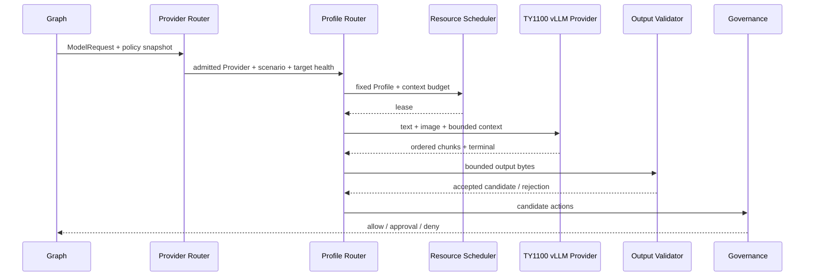

# Model、Scheduler 与外部模型 Provider 模块详设

版本：1.4
适用范围：Android 13 生产软件
上级文档：[生产软件开发文档](../CENTRAL_BRAIN_SOFTWARE_DEVELOPMENT.md)

`production_document_scope=true`
`module_detailed_design=true`
`production_ready=false`
`target_hardware_validated=false`

## 1. 设计目标与边界

本模块定义统一 Model Provider 生命周期、资源调度、策略路由、座舱 prompt、结构化输出校验，以及 Android
通过车载以太网直连 TY1100 vLLM 的当前目标合同。后续替换为其他模型服务或 Vendor NPU 时，上层
Session/Graph/Effect 语义不变。

模型只生成候选场景、参数和摘要；任何输出都必须经过 Schema、Capability 白名单、Governance 和
Effect gate。Provider 失败不能进入车辆执行。

## 2. 需求映射

| Req ID | 本模块责任 |
| --- | --- |
| `APP-002` | 单帧图像与文本绑定同一多模态请求 |
| `APP-004` | 注入座舱角色、驾驶服务目标、能力和安全边界 |
| `APP-006` | 任意文本绑定座舱上下文并产生有界回复与候选动作 |
| `APP-007` | 吸烟场景文本与同帧图像进入专用 Agent |
| `S2-MDL-001` | Provider 描述、健康、预热、推理、流式、取消、指标和故障 |
| `S2-MDL-002` | 先按策略选择 Provider，再按场景确定性选择模型 Profile；绑定身份、上下文和健康且禁止静默回退 |
| `S2-MDL-003` | 当前 TY1100 vLLM 直连接口与后续 Provider 替换 |
| `S2-MDL-004` | 严格结构化输出和 capability 白名单 |
| `S2-MDL-005` | 不可用、非法、超时和取消失败时阻止 Effect |
| `S2-MDL-006` | 凭据不进入日志、Event 或 HMI |
| `S2-MDL-007` | 吸烟检测五字段输出的严格解析和不确定结果规范化 |
| `S2-MDL-008` | 自报置信度、token 概率和版本化真实正确率校准的边界 |
| `S2-SAF-006` | 专用检测 Agent 无 Tool、Effect 或业务处置权限 |

## 3. 源码地图

| 代码路径 | 关键符号 | 设计责任 |
| --- | --- | --- |
| [ModelProvider.java](../../central-brain/android-runtime/runtime-service/src/main/java/com/centralbrain/runtime/model/ModelProvider.java) | descriptor、snapshot、warmup、infer、cancel、metrics、fault | Provider SPI |
| [ModelContractV2.java](../../central-brain/android-runtime/runtime-service/src/main/java/com/centralbrain/runtime/model/ModelContractV2.java) | `ModelRequest`、`ModelResult`、budgets | 上层模型合同 |
| [ModelProviderRegistry.java](../../central-brain/android-runtime/runtime-service/src/main/java/com/centralbrain/runtime/model/ModelProviderRegistry.java) | fixed catalog、health publish、snapshot | Provider 目录与健康 |
| [PolicyAwareModelRouter.java](../../central-brain/android-runtime/runtime-service/src/main/java/com/centralbrain/runtime/model/PolicyAwareModelRouter.java) | policy snapshot、route decision | assurance/资源/网络路由 |
| [ModelProfileRouter.java](../../central-brain/android-runtime/runtime-service/src/main/java/com/centralbrain/runtime/model/ModelProfileRouter.java) | `TargetHealth`、`RouteDecision`、`decide` | Provider 内确定性模型 Profile 路由和失败关闭 |
| [InferenceResourceScheduler.java](../../central-brain/android-runtime/runtime-service/src/main/java/com/centralbrain/runtime/scheduler/InferenceResourceScheduler.java) | `admit`、`claimNext`、`cancelOwned`、`settle` | queue/slot/deadline |
| [ModelResourceAdmission.java](../../central-brain/android-runtime/runtime-service/src/main/java/com/centralbrain/runtime/scheduler/ModelResourceAdmission.java) | `admit` | Router 与 Scheduler 准入组合 |
| [CockpitModelPrompt.java](../../central-brain/android-runtime/runtime-service/src/main/java/com/centralbrain/runtime/model/CockpitModelPrompt.java) | `forScenario`、`forFreeform`、`forMultimodal` | 固定座舱 system/user instruction 与动作白名单 |
| [StructuredModelOutput.java](../../central-brain/android-runtime/runtime-service/src/main/java/com/centralbrain/runtime/model/StructuredModelOutput.java) | `validate`、`AcceptedOutput` | 严格 JSON 和能力参数 |
| [SmokingDetectionResult.java](../../central-brain/android-runtime/runtime-service/src/main/java/com/centralbrain/runtime/model/SmokingDetectionResult.java) | `parse`、`DecisionStatus`、`toCompactJson` | 吸烟检测专用五字段边界 |
| [CabinComplianceAgentRouter.java](../../central-brain/android-runtime/runtime-service/src/main/java/com/centralbrain/runtime/agent/CabinComplianceAgentRouter.java) | `routeExplicit`、`routeCandidate` | 专用 Agent 准入 |
| [smoking agent prompt](../../central-brain/android-runtime/runtime-service/src/main/assets/agents/smoking-detection-agent-v1.md) | 角色、摄像头坐标、判定和输出规则 | 版本化 Agent 指令 |
| [smoking scenario manifest](../../central-brain/android-runtime/runtime-service/src/main/assets/scenarios/scene.cabin.compliance.smoking.v1.json) | response-only DAG | 场景和策略绑定 |
| [VllmEndpointConfig.java](../../central-brain/android-runtime/runtime-service/src/main/java/com/centralbrain/runtime/model/VllmEndpointConfig.java) | target Ethernet factories、URI getters | TY1100 固定端点、模型和上下文合同 |
| [runtime-service build.gradle.kts](../../central-brain/android-runtime/runtime-service/build.gradle.kts) | `centralBrainTargetTy1100Ethernet`、BuildConfig | 互斥目标构建配置 |
| [ModelRuntimeReadinessSnapshot.java](../../central-brain/android-runtime/runtime-service/src/main/java/com/centralbrain/runtime/model/ModelRuntimeReadinessSnapshot.java) | blockers | production 推理激活门槛 |
| [model output schema](../../central-brain/android-runtime/runtime-service/src/main/assets/model/model-structured-output-v1.schema.json) | JSON Schema | 输出文件合同 |
| [TY1100 target contract](../../central-brain/contracts/central_brain_android_ty1100_ethernet_target_v1.json) | endpoint、routing、claims、evidence | 机器可读目标集成合同 |

## 4. 核心设计

### 4.1 Provider SPI

Provider descriptor 固定声明 backend kind、assurance、fallback class、生命周期能力、是否硬件支持和最大并发。
Provider 必须实现：

- `descriptor()` 和 `snapshot()`；
- `warmup(ModelSpec)`；
- `infer(InferenceRequest, StreamObserver)`；
- `cancel(requestId, reason)`；
- `metrics()` 和 `lastFault()`；
- `close()`。

流式 chunk 的 sequence 必须从固定起点单调递增，terminal 最多一次。取消成功后不得继续交付 chunk。

### 4.2 Prompt

`CockpitModelPrompt` 固定 system instruction，明确模型位于汽车座舱、目标是服务驾驶员和乘员、只可提出
allowed actions、不能宣称已执行动作。多模态 prompt 同时绑定 utterance、seat-area Context、image digest、
allowed/required actions。

`forFreeform()` 接收 1..1024 字符的自然语言目标，至少要求 `assistant.respond`，并将候选动作限制为
回复、座舱温控、座椅、媒体和休息区导航能力集合。`validateActions()` 拒绝未知动作、重复动作、
超过四个动作或缺失必要动作。该校验只产生候选集合，不授予 Tool 或 Effect 权限。

### 4.3 两级调度与路由

`PolicyAwareModelRouter` 先检查 privacy、network、thermal、health、capability 和 assurance；
`ModelResourceAdmission` 计算有效 token、deadline、queue wait 和 priority；`InferenceResourceScheduler`
再执行 global/owner/provider 容量和 deadline 排队。

Provider 选定后，`ModelProfileRouter` 根据 canonical scenario ID、required capability、fallback policy 和
带有效期的 `TargetHealth` 选择模型 Profile。吸烟合规视觉场景选择专用 Profile，其余场景选择通用 Profile。
Profile ID、内部 model ID、served model、最大上下文和健康摘要都进入 route digest。

Provider 不可用时 fallback 必须由请求和 privacy policy 显式允许，不能静默切换到更低 assurance。
专用 Model Profile 不可用时必须失败关闭，不能回退到通用 Profile。两级 Router 和 Agent Router 都只产生
路由证据，不调用模型，也不授予 Tool 或 Effect 权限。

### 4.4 常驻、预热与上下文裁剪

Provider 在发布 route-ready 前必须完成 `/health` 等价健康检查、模型目录身份检查和真实预热。文字 Profile
使用带结构化输出约束的文字预热；视觉 Profile 使用一张有界图像和文字共同预热，避免只初始化文本通道。
需要满足低时延目标的 Profile 由资源计划常驻；任何进程退出、模型身份漂移、上下文上限变化或健康过期都会
撤销可路由状态。

每个 Profile 的最大上下文是构建时合同。组装器先保留 system/safety/Schema、当前图文输入和车辆安全
Context，再放入活动计划和会话摘要，最后放入较旧历史。超限时从最低优先级历史开始裁剪；不得删除当前图像、
输出 Schema、安全约束或请求 fingerprint 所覆盖的内容。

### 4.5 TY1100 vLLM 直连边界

`VllmEndpointConfig.ty1100General2bViaTargetEthernet()` 与
`ty1100Smoking2bViaTargetEthernet()` 固定 `169.254.202.110:8000` 和 `Qwen3.5-2B-AWQ`，禁止调用方覆盖
host、port 或 served model。两个逻辑 Profile 分别保留 8192/4096 token 上限和不同 route identity。

Provider 使用 OpenAI-compatible `/v1/models` 做身份门禁，使用 `/v1/chat/completions` 发送文字或单帧图文
请求。完整字段、超时、错误映射与 release 迁移要求由
[TY1100 vLLM 生产以太网 API 详设](11a-openclaw-production-ethernet-api.md)定义。当前网络执行器尚未迁入 release
组合根，也未达到 `PRODUCTION` assurance，不能把局部硬件通过误记为 release 完成。

### 4.6 结构化输出

`StructuredModelOutput.validate()` 严格解析 UTF-8 JSON，拒绝 unknown field、重复参数、超限、非法 enum、
scenario/catalog/capability digest 不匹配和超出 `TargetRange` 的参数。接受结果仍设置
`actionAuthorizationGranted=false`、`effectDispatchRequested=false`。

吸烟检测不复用车辆动作候选 Schema。`CockpitModelPrompt.OutputContract.SMOKING_DETECTION_V1` 选择版本化
Agent 指令，Provider 返回的原始内容先由 `SmokingDetectionResult.parse()` 严格读取。只允许以下字段：

| 字段 | 约束 |
| --- | --- |
| `smoking_detected` | 整数 0 或 1 |
| `person_count` | 整数 0..2 |
| `location` | 四个图片坐标常量或 `UNKNOWN` |
| `confidence` | 有限浮点数 0..1 |
| `description` | 1..120 字符且无控制字符 |

低于 0.5 的结果必须使用 `smoking_detected=0`、`person_count=0`、`location=UNKNOWN`，并在描述中标明
`uncertain`。阳性结果必须有非零人数和确定位置；阴性结果不得保留吸烟位置。通过校验后，Runtime 才把
紧凑 JSON 放入现有 assistant projection，并固定候选动作为 `assistant.respond`。

快速 wire 的三个互斥 Schema 分支必须分别约束阴性、阳性和不确定状态，避免生成“阴性但保留位置”等
语义非法组合。`SmokingDetectionResult.parseCompactWire()` 必须执行独立二次校验。模型自报置信度和
Provider token 概率只能作为未校准信号；生产校准器必须版本化绑定模型、提示词、预处理、Schema 和数据
摘要，并在独立分组验证后由发布门禁启用。当前没有满足门槛的生产校准器，运行时不得加载试验系数。

## 5. 接口与数据

多模态请求必须在同一 request ID 下绑定：

| 字段 | 规则 |
| --- | --- |
| text | UTF-8，有界，作为用户输入 |
| image | 单帧 PNG/JPEG，有界字节，带 SHA-256 |
| context | seat-area、车辆状态、能力和安全摘要 |
| trace/request | canonical ID 与 fingerprint |
| budgets | latency、input/output/total token |
| privacy | classification 与允许的 transport |

网络层只返回 Provider chunk/terminal；业务层必须再执行 `StructuredModelOutput.validate()`。
文字单模态请求不携带伪造的图片字段；文字与图片请求必须显式区分 input mode。

## 6. 关键流程

## 7. 失败关闭与并发

- Provider health stale/unhealthy、assurance 不足或 capability 不符时不调用网络。
- Model Profile 身份、上下文或健康不匹配时不得调用 Provider，且不得静默选择通用 Profile。
- 未完成真实预热或常驻目标已退出时撤销 route-ready。
- queue wait 和 task deadline 任一到期即终止。
- chunk 超限、乱序、重复 terminal 或 request ID 不匹配均隔离 Provider fault。
- image/text/context 必须共享 request fingerprint。
- 输出 Schema 失败不进入 repair 后的车辆动作；任何 repair 仍需完整复验。
- 凭据不得拼入异常消息或 telemetry。
- 当前 release Provider 未装配时 readiness 必须保持 blocked。

## 8. 代码校对清单

- [ ] Provider 实现覆盖 SPI 全生命周期。
- [ ] descriptor assurance 与实际 transport/硬件证据一致。
- [ ] Router 顺序检查 privacy、network、thermal、health、capability。
- [ ] Provider Router 与 Model Profile Router 分层，route digest 可追踪且无模型自选路径。
- [ ] 专用 Profile 不可用时失败关闭，不回退到通用模型。
- [ ] route-ready 前完成模型身份、上下文、文字/视觉真实预热检查。
- [ ] 上下文裁剪保留 safety、Schema、当前图文输入和当前车辆 Context。
- [ ] Scheduler 限制 global/owner/provider 并发和 deadline。
- [ ] prompt 含座舱角色、服务目标、白名单和禁止自证执行。
- [ ] 任意文本只产生结构化回复和最多四个白名单候选动作。
- [ ] 多模态 text/image/context 绑定同一 request fingerprint。
- [ ] 输出严格拒绝 unknown field 和 capability/range 越界。
- [ ] 吸烟检测拒绝重复字段、未知位置、阳性低置信度和未规范化不确定结果。
- [ ] 快速 wire 的三个条件 Schema 分支与 `parseCompactWire()` 语义一致。
- [ ] 校准器只在模型/指令/预处理/Schema/清单摘要匹配且独立 Brier、ECE 和分类门槛通过时启用。
- [ ] 图文 Provider 对吸烟场景声明并满足 `VISION_CLASSIFICATION`。
- [ ] 凭据不进入日志、Event、HMI、异常和审计。
- [ ] Provider 失败时 Effect dispatch 保持 false。

## 9. 增量开发规则

把 target-integration vLLM 网络执行器迁入 release 时应新增生产 `ModelProvider` 组合、受控 Ethernet Network
绑定、HTTP/JSON 流式 parser、取消、metrics、fault isolation 和 factory 注入；不得修改 Graph/Effect 合同。
切换其他模型服务时新增 profile 和 Provider，再由 Router policy 选择，不能绕过统一输出校验。

## 10. 当前缺口

- production vLLM `ModelProvider` 的 release 源集实现和装配尚未完成。
- 当前 HTTP 链路尚未完成生产网络隔离、传输保护和服务身份 assurance。
- Vendor NPU 和其他后续 Provider 尚未生产合格。
- 任意文本候选动作到 typed Plan、Tool 参数和 EffectIntent 的生产编译器尚未激活。
- `production_ready=false`，`target_hardware_validated=false`。
