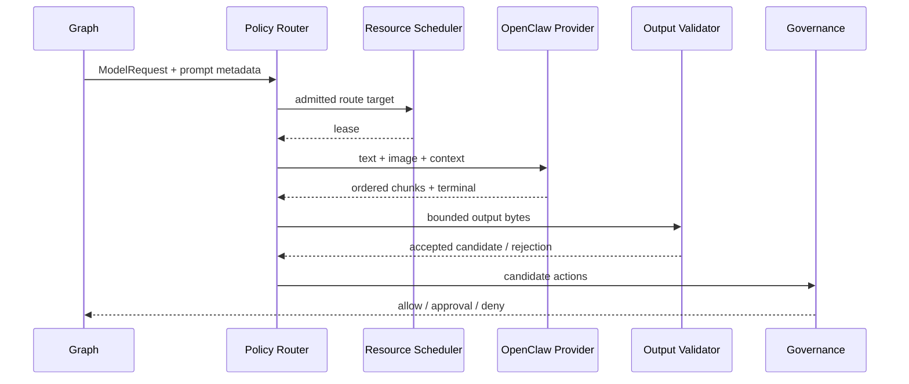

# Model、Scheduler 与 OpenClaw 过渡 Provider 模块详设

版本：1.0
适用范围：Android 13 生产软件
上级文档：[生产软件开发文档](../CENTRAL_BRAIN_SOFTWARE_DEVELOPMENT.md)

`production_document_scope=true`
`module_detailed_design=true`
`production_ready=false`
`target_hardware_validated=false`

## 1. 设计目标与边界

本模块定义统一 Model Provider 生命周期、资源调度、策略路由、座舱 prompt、结构化输出校验，以及当前通过
车载以太网访问 OpenClaw 的过渡合同。后续替换为 Ollama 或 Vendor NPU 时，上层 Session/Graph/Effect
语义不变。

模型只生成候选场景、参数和摘要；任何输出都必须经过 Schema、Capability 白名单、Governance 和
Effect gate。Provider 失败不能进入车辆执行。

## 2. 需求映射

| Req ID | 本模块责任 |
| --- | --- |
| `APP-002` | 单帧图像与文本绑定同一多模态请求 |
| `APP-004` | 注入座舱角色、驾驶服务目标、能力和安全边界 |
| `S2-MDL-001` | Provider 描述、健康、预热、推理、流式、取消、指标和故障 |
| `S2-MDL-002` | 按模态、资源、健康和 assurance 路由 |
| `S2-MDL-003` | 当前 OpenClaw 过渡接口与后续 Provider 替换 |
| `S2-MDL-004` | 严格结构化输出和 capability 白名单 |
| `S2-MDL-005` | 不可用、非法、超时和取消失败时阻止 Effect |
| `S2-MDL-006` | 凭据不进入日志、Event 或 HMI |

## 3. 源码地图

| 代码路径 | 关键符号 | 设计责任 |
| --- | --- | --- |
| [ModelProvider.java](../../central-brain/android-runtime/runtime-service/src/main/java/com/centralbrain/runtime/model/ModelProvider.java) | descriptor、snapshot、warmup、infer、cancel、metrics、fault | Provider SPI |
| [ModelContractV2.java](../../central-brain/android-runtime/runtime-service/src/main/java/com/centralbrain/runtime/model/ModelContractV2.java) | `ModelRequest`、`ModelResult`、budgets | 上层模型合同 |
| [ModelProviderRegistry.java](../../central-brain/android-runtime/runtime-service/src/main/java/com/centralbrain/runtime/model/ModelProviderRegistry.java) | fixed catalog、health publish、snapshot | Provider 目录与健康 |
| [PolicyAwareModelRouter.java](../../central-brain/android-runtime/runtime-service/src/main/java/com/centralbrain/runtime/model/PolicyAwareModelRouter.java) | policy snapshot、route decision | assurance/资源/网络路由 |
| [InferenceResourceScheduler.java](../../central-brain/android-runtime/runtime-service/src/main/java/com/centralbrain/runtime/scheduler/InferenceResourceScheduler.java) | `admit`、`claimNext`、`cancelOwned`、`settle` | queue/slot/deadline |
| [ModelResourceAdmission.java](../../central-brain/android-runtime/runtime-service/src/main/java/com/centralbrain/runtime/scheduler/ModelResourceAdmission.java) | `admit` | Router 与 Scheduler 准入组合 |
| [CockpitModelPrompt.java](../../central-brain/android-runtime/runtime-service/src/main/java/com/centralbrain/runtime/model/CockpitModelPrompt.java) | `forScenario`、`forMultimodal` | 固定座舱 system/user instruction |
| [StructuredModelOutput.java](../../central-brain/android-runtime/runtime-service/src/main/java/com/centralbrain/runtime/model/StructuredModelOutput.java) | `validate`、`AcceptedOutput` | 严格 JSON 和能力参数 |
| [OpenClawEndpointConfig.java](../../central-brain/android-runtime/runtime-service/src/main/java/com/centralbrain/runtime/model/OpenClawEndpointConfig.java) | `targetProductionTransitional`、URI getters | 生产过渡端点配置 |
| [OllamaEndpointConfig.java](../../central-brain/android-runtime/runtime-service/src/main/java/com/centralbrain/runtime/model/OllamaEndpointConfig.java) | `productionLinkLocal` | 后续 Ollama 端点合同 |
| [ModelProviderProfiles.java](../../central-brain/android-runtime/runtime-service/src/main/java/com/centralbrain/runtime/model/ModelProviderProfiles.java) | `targetOpenClawTransitional`、`vendorNpuEmpty` | 固定 Provider profile |
| [ModelRuntimeReadinessSnapshot.java](../../central-brain/android-runtime/runtime-service/src/main/java/com/centralbrain/runtime/model/ModelRuntimeReadinessSnapshot.java) | blockers | production 推理激活门槛 |
| [model output schema](../../central-brain/android-runtime/runtime-service/src/main/assets/model/model-structured-output-v1.schema.json) | JSON Schema | 输出文件合同 |
| [OpenClaw target contract](../../central-brain/contracts/central_brain_android_openclaw_target_gateway_v1.json) | transport/endpoint/assurance | 机器可读外部合同 |
| [OpenClaw multimodal contract](../../central-brain/contracts/central_brain_android_openclaw_multimodal_gateway_v1.json) | image/text envelope | 多模态合同 |

## 4. 核心设计

### 4.1 Provider SPI

Provider descriptor 固定声明 backend kind、assurance、fallback class、生命周期能力、是否硬件支持和最大并发。
Provider 必须实现：

- `descriptor()` 和 `snapshot()`；
- `warmup(ModelSpec)`；
- `infer(InferenceRequest, StreamObserver)`；
- `cancel(requestId, reason)`；
- `metrics()` 和 `lastFault()`；
- `close()`。

流式 chunk 的 sequence 必须从固定起点单调递增，terminal 最多一次。取消成功后不得继续交付 chunk。

### 4.2 Prompt

`CockpitModelPrompt` 固定 system instruction，明确模型位于汽车座舱、目标是服务驾驶员和乘员、只可提出
allowed actions、不能宣称已执行动作。多模态 prompt 同时绑定 utterance、seat-area Context、image digest、
allowed/required actions。

### 4.3 调度与路由

`PolicyAwareModelRouter` 先检查 privacy、network、thermal、health、capability 和 assurance；
`ModelResourceAdmission` 计算有效 token、deadline、queue wait 和 priority；`InferenceResourceScheduler`
再执行 global/owner/provider 容量和 deadline 排队。

Provider 不可用时 fallback 必须由请求和 privacy policy 显式允许，不能静默切换到更低 assurance。

### 4.4 OpenClaw 过渡边界

`OpenClawEndpointConfig.targetProductionTransitional()` 固定生产 link-local host、协议版本、连接和读取超时，
并构造 WebSocket/控制 URI。凭据封装在配置对象中，但不得出现在日志、Event、HMI、异常或文档。

当前 `release` 源集尚无实现 `ModelProvider` 的 OpenClaw 网络执行器，也未把该 Provider 装配到
production router。因此配置与合同已存在，但生产推理尚未激活。

### 4.5 结构化输出

`StructuredModelOutput.validate()` 严格解析 UTF-8 JSON，拒绝 unknown field、重复参数、超限、非法 enum、
scenario/catalog/capability digest 不匹配和超出 `TargetRange` 的参数。接受结果仍设置
`actionAuthorizationGranted=false`、`effectDispatchRequested=false`。

## 5. 接口与数据

多模态请求必须在同一 request ID 下绑定：

| 字段 | 规则 |
| --- | --- |
| text | UTF-8，有界，作为用户输入 |
| image | 单帧 PNG/JPEG，有界字节，带 SHA-256 |
| context | seat-area、车辆状态、能力和安全摘要 |
| trace/request | canonical ID 与 fingerprint |
| budgets | latency、input/output/total token |
| privacy | classification 与允许的 transport |

网络层只返回 Provider chunk/terminal；业务层必须再执行 `StructuredModelOutput.validate()`。

## 6. 关键流程

## 7. 失败关闭与并发

- Provider health stale/unhealthy、assurance 不足或 capability 不符时不调用网络。
- queue wait 和 task deadline 任一到期即终止。
- chunk 超限、乱序、重复 terminal 或 request ID 不匹配均隔离 Provider fault。
- image/text/context 必须共享 request fingerprint。
- 输出 Schema 失败不进入 repair 后的车辆动作；任何 repair 仍需完整复验。
- 凭据不得拼入异常消息或 telemetry。
- 当前 release Provider 未装配时 readiness 必须保持 blocked。

## 8. 代码校对清单

- [ ] Provider 实现覆盖 SPI 全生命周期。
- [ ] descriptor assurance 与实际 transport/硬件证据一致。
- [ ] Router 顺序检查 privacy、network、thermal、health、capability。
- [ ] Scheduler 限制 global/owner/provider 并发和 deadline。
- [ ] prompt 含座舱角色、服务目标、白名单和禁止自证执行。
- [ ] 多模态 text/image/context 绑定同一 request fingerprint。
- [ ] 输出严格拒绝 unknown field 和 capability/range 越界。
- [ ] 凭据不进入日志、Event、HMI、异常和审计。
- [ ] Provider 失败时 Effect dispatch 保持 false。

## 9. 增量开发规则

实现 production OpenClaw Provider 时应新增 `ModelProvider` 实现、受控 HTTP/WebSocket transport、流式 parser、
取消、metrics、fault isolation 和 factory 注入；不得修改 Graph/Effect 合同。切换 Ollama 时新增 profile 和
Provider，再由 Router policy 选择，不能复用 OpenClaw 响应 parser。

## 10. 当前缺口

- production OpenClaw `ModelProvider` 实现和 release 装配尚未完成。
- 固定凭据需要迁移到受控 secret owner，当前属于发布风险。
- Vendor NPU 和后续 Ollama Provider 尚未生产合格。
- `production_ready=false`，`target_hardware_validated=false`。
