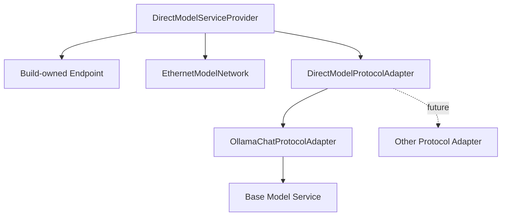
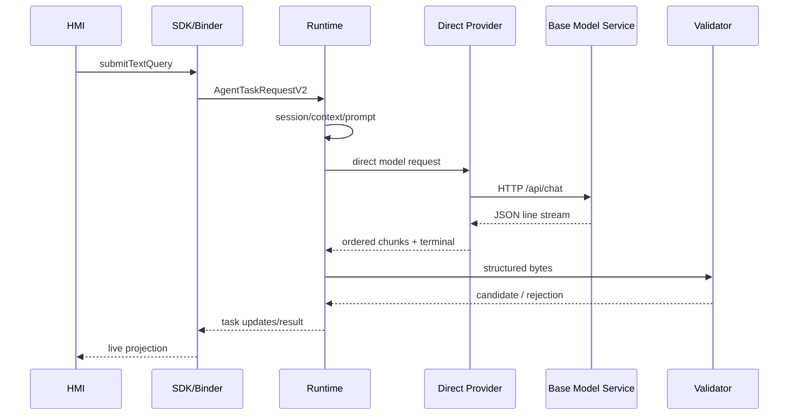
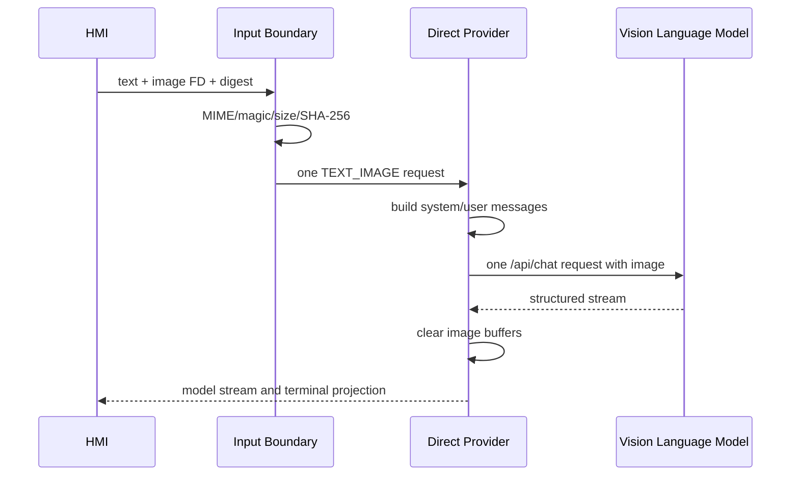
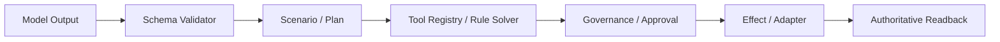

# 上层应用经车载以太网直连基座模型服务接口详设

版本：2.0
适用范围：Android 13 生产软件
上级文档：[生产软件开发文档](../CENTRAL_BRAIN_SOFTWARE_DEVELOPMENT.md)

`production_document_scope=true`
`module_detailed_design=true`
`production_ready=false`
`target_hardware_validated=false`

## 1. 设计目标与边界

本文定义上层座舱应用提交文字或“文字 + 单帧图片”任务后，Central Brain Runtime 如何经车载以太网
直接调用算力基座中的模型服务，并把流式回复、结构化候选和失败状态返回上层应用。

新链路不包含外部 Agent Gateway：

```text
Client2
  -> Central Brain SDK / Binder
  -> Session / Context / Graph
  -> Model Router / Scheduler
  -> DirectModelServiceProvider
  -> Model Protocol Adapter
  -> Base Model Service
```

### 1.1 责任变化

| 能力 | 新 owner |
| --- | --- |
| 会话 ID、历史摘要和恢复 | Central Brain Session/Memory |
| 座舱 system/user Prompt | Central Brain Prompt Builder |
| 图片与文字绑定 | Central Brain Input Boundary |
| Tool 候选和调用 | Central Brain Tool Runtime |
| Scenario 和 Plan | Central Brain Graph Runtime |
| 重试、取消、deadline | Central Brain Provider/Scheduler |
| 结构化输出 | Central Brain Schema Validator |
| 动作准入 | Governance/Approval |
| 模型推理 | 外部 Base Model Service |

模型服务只接收推理输入并返回模型输出，不持有车辆权限、Tool 执行权、用户审批权或 Effect dispatch 权。

### 1.2 生产端点基线

| 字段 | 当前合同 |
| --- | --- |
| Provider ID | `external.model-service.direct` |
| Backend | `DIRECT_MODEL_SERVICE` |
| 物理网络 | Android 座舱域控制器到算力基座的车载以太网 |
| Base URI | `http://169.254.208.110:11434` |
| Chat URI | `http://169.254.208.110:11434/api/chat` |
| Wire protocol | `OLLAMA_CHAT_V1` |
| Agent Gateway | 不需要 |
| Endpoint override | 禁止 |
| Redirect | 禁止 |
| Connect timeout | 3000 ms |
| Read/request deadline | 最长 120000 ms |
| 图片 | 最多 1 张 PNG/JPEG，最大 6 MiB |
| Response | 最多 65536 bytes，必须是结构化 JSON |

当前端点是协议 Adapter 的第一个实现，并不是 AIOS 公共接口。后续切换为 OpenAI-compatible 或 Vendor
Native 模型服务时，上层 Binder、Session、Graph、Tool 和 Effect 合同不变。

## 2. 需求映射

| Req ID | 本模块责任 |
| --- | --- |
| `APP-001` | 上层应用通过 SDK/Binder 提交任务 |
| `APP-002` | 文字与单图绑定同一视觉语言请求 |
| `APP-004` | 注入座舱角色、上下文和能力边界 |
| `APP-005` | HMI 接收输入、流式输出、计划和失败状态 |
| `S2-MDL-001` | Direct Provider 生命周期与推理 |
| `S2-MDL-002` | 文字/图片 capability 和策略路由 |
| `S2-MDL-003` | AIOS 直连模型并拥有 Agent 编排职责 |
| `S2-MDL-004` | provider-neutral 结构化 Schema |
| `S2-MDL-005` | timeout、cancel、网络和 parser 失败关闭 |
| `S2-MDL-006` | 模型内容、Endpoint 和认证材料隔离 |
| `S2-OBS-001` | 有界 metrics 和 failure code |
| `S2-OBS-002` | request/session/provider/stream 关联 |
| `S2-SAF-001` | 模型输出不能直接执行 Tool/Effect |

## 3. 源码地图

### 3.1 已有源码

| 路径 | 符号 | 责任 |
| --- | --- | --- |
| [ICentralBrainRuntime.aidl](../../central-brain/android-runtime/central-brain-sdk/src/main/aidl/com/centralbrain/sdk/production/ICentralBrainRuntime.aidl) | task submit/cancel/status | 上层 Binder |
| [CentralBrainClient.java](../../central-brain/android-runtime/central-brain-sdk/src/main/java/com/centralbrain/sdk/CentralBrainClient.java) | Java facade | 上层 SDK |
| [ModelProvider.java](../../central-brain/android-runtime/runtime-service/src/main/java/com/centralbrain/runtime/model/ModelProvider.java) | `DIRECT_MODEL_SERVICE`、SPI | Provider 合同 |
| [ModelContractV2.java](../../central-brain/android-runtime/runtime-service/src/main/java/com/centralbrain/runtime/model/ModelContractV2.java) | model request/result | 路由元数据 |
| [DirectModelServiceContract.java](../../central-brain/android-runtime/runtime-service/src/main/java/com/centralbrain/runtime/model/DirectModelServiceContract.java) | endpoint/modality/request | 直连合同 |
| [OllamaEndpointConfig.java](../../central-brain/android-runtime/runtime-service/src/main/java/com/centralbrain/runtime/model/OllamaEndpointConfig.java) | fixed production URI | Ollama Adapter 配置 |
| [OllamaChatProtocolAdapter.java](../../central-brain/android-runtime/runtime-service/src/main/java/com/centralbrain/runtime/model/OllamaChatProtocolAdapter.java) | request/NDJSON/cancel | 已实现协议 Adapter |
| [DirectModelServiceProvider.java](../../central-brain/android-runtime/runtime-service/src/main/java/com/centralbrain/runtime/model/DirectModelServiceProvider.java) | lifecycle/input/terminal | 已实现 Provider 核心 |
| [ModelProviderRegistry.java](../../central-brain/android-runtime/runtime-service/src/main/java/com/centralbrain/runtime/model/ModelProviderRegistry.java) | direct provider catalog | 目录与 health |
| [PolicyAwareModelRouter.java](../../central-brain/android-runtime/runtime-service/src/main/java/com/centralbrain/runtime/model/PolicyAwareModelRouter.java) | direct route preference | 路由 |
| [CockpitModelPrompt.java](../../central-brain/android-runtime/runtime-service/src/main/java/com/centralbrain/runtime/model/CockpitModelPrompt.java) | cockpit instruction | Prompt |
| [StructuredModelOutput.java](../../central-brain/android-runtime/runtime-service/src/main/java/com/centralbrain/runtime/model/StructuredModelOutput.java) | strict validate | 输出校验 |
| [AndroidManifest.xml](../../central-brain/android-runtime/runtime-service/src/main/AndroidManifest.xml) | network permission | Runtime 权限 |
| [network_security_config.xml](../../central-brain/android-runtime/runtime-service/src/main/res/xml/network_security_config.xml) | target-only policy | 网络策略 |
| [machine-readable contract](../../central-brain/contracts/central_brain_android_direct_model_service_v1.json) | endpoint、migration、claims | 机器合同 |

### 3.2 待新增生产代码

| 目标路径 | 目标类 | 责任 |
| --- | --- | --- |
| `central-brain-sdk/src/main/aidl/.../AgentTaskRequestV2.aidl` | `AgentTaskRequestV2` | text + optional image FD |
| `central-brain-sdk/src/main/aidl/.../ModelImageAttachment.aidl` | image metadata | MIME/size/digest/FD |
| `runtime-service/src/main/java/.../ProductionModelInputStore.java` | input owner | bounded consume-once |
| `runtime-service/src/main/java/.../DirectModelProtocolAdapter.java` | 可选 protocol SPI | 多后端扩展时抽取 |
| `runtime-service/src/main/java/.../EthernetModelNetwork.java` | Network owner | Ethernet socket factory |
| `runtime-service/src/release/java/.../ModelProviderFactory.java` | composition | release registration |

## 4. 核心设计

### 4.1 上层接口

上层应用继续通过 Central Brain SDK：

```java
TaskHandle submitTextQuery(TextQuery query, TaskListener listener);

TaskHandle submitMultimodalQuery(
        MultimodalQuery query,
        TaskListener listener);

boolean cancelTask(TaskHandle handle, CancelReason reason);
```

上层应用不能传入：

- model service URI；
- wire protocol；
- model name；
- Provider ID；
- HTTP header 或认证材料；
- Tool implementation；
- Vehicle capability override。

这些内容由受控 Runtime profile 和 capability catalog 决定。

### 4.2 Binder V2

图片不能进入 Binder `byte[]`。生产 V2 DTO：

```aidl
parcelable ModelImageAttachment {
    int schemaVersion = 1;
    String attachmentId = "";
    String mimeType = "";
    String fileName = "";
    long byteCount = 0;
    String sha256 = "";
    long capturedAtElapsedRealtimeMs = 0;
    ParcelFileDescriptor contentFd;
}

parcelable AgentTaskRequestV2 {
    int schemaVersion = 2;
    String clientRequestId = "";
    String sessionId = "";
    String scenarioHint = "";
    String utterance = "";
    String locale = "";
    long deadlineElapsedRealtimeMs = 0;
    int priority = 0;
    String idempotencyKey = "";
    String contextDigest = "";
    ModelImageAttachment image;
}
```

V1 保持兼容；V2 追加新的 transaction 和 interface hash。图片请求不能在 V1 中丢图降级。

### 4.3 AIOS 会话

底座模型服务不作为权威会话存储。每次请求由 Central Brain 选择并组装：

```text
system instruction
bounded session summary
bounded context snapshot
current user utterance
optional current image
allowed/required actions
response JSON schema
```

长期历史先经过 Memory/Context Budget 形成摘要。不得把完整历史、车辆原始总线或未授权个人数据直接发送
模型服务。

### 4.4 Direct Provider 与协议 Adapter



Provider 只依赖 `DirectModelProtocolAdapter`：

```java
interface DirectModelProtocolAdapter {
    CapabilitySnapshot capabilities();
    HealthSnapshot health(Deadline deadline);
    CallHandle start(
            ModelEnvelope envelope,
            ModelStreamObserver observer);
    CancelState cancel(String requestId);
    void close();
}
```

Adapter 负责 wire JSON/HTTP；Provider 负责生命周期、调度、关联、metrics 和 fault isolation。

### 4.5 Request fingerprint

```text
inputDigest =
  SHA256(textDigest | imageDigest-or-empty | contextDigest)

requestFingerprint =
  SHA256(schemaVersion | endpointProfile | protocol | modelName |
         requestId | sessionId | idempotencyKey | modality |
         inputDigest | responseSchemaDigest | deadline)
```

服务响应不携带 request ID 时，Provider 必须使用唯一活动 HTTP call 与本地 request ID 绑定；不能在一个
连接上混合多个无法区分的 stream。

### 4.6 Tool 与 Effect

底座支持 function calling 也不能改变权限模型：

1. Adapter 把 function/tool call 解析为 `ToolCandidate`。
2. Tool name、schema、arguments 进入 Tool Registry 和 Rule Solver。
3. Scenario/Graph 决定候选是否属于当前节点。
4. Governance 检查身份、车辆状态、审批和 capability。
5. Tool Executor 或 Effect Coordinator 才能执行。

模型响应中的“已执行”文本不形成执行证据。

## 5. 接口与数据

### 5.1 文字请求

发送到 `/api/chat` 的 Ollama Adapter envelope：

```json
{
  "model": "<build-owned-model-name>",
  "stream": true,
  "think": false,
  "keep_alive": "5m",
  "messages": [
    {
      "role": "system",
      "content": "<bounded-cockpit-system-instruction>"
    },
    {
      "role": "user",
      "content": "<bounded-context-and-user-instruction>"
    }
  ],
  "format": {
    "type": "object",
    "additionalProperties": false
  },
  "options": {
    "temperature": 0,
    "num_predict": 192
  }
}
```

`format` 必须使用仓库冻结的完整 JSON Schema，示例只展示顶层。

### 5.2 图片与文字请求

图片属于当前 user message：

```json
{
  "model": "<build-owned-vision-language-model>",
  "stream": true,
  "think": false,
  "messages": [
    {
      "role": "system",
      "content": "<bounded-cockpit-system-instruction>"
    },
    {
      "role": "user",
      "content": "<bounded-context-and-user-instruction>",
      "images": [
        "<base64-image>"
      ]
    }
  ],
  "format": {
    "type": "object",
    "additionalProperties": false
  }
}
```

Base64 只存在于 Runtime 到模型服务的请求内存和网络 body。编码前必须计算最坏请求大小；图片完成发送后
覆盖原始和编码缓冲。

### 5.3 图片约束

| 字段 | 规则 |
| --- | --- |
| count | 0 或 1 |
| MIME | `image/png`、`image/jpeg` |
| bytes | `1..6291456` |
| SHA-256 | 64 位小写十六进制 |
| magic | 必须与 MIME 一致 |
| FD | 只读、consume-once |
| persistence | 不保存原图 |

### 5.4 流式响应

Ollama Adapter 按有界 JSON line 读取：

```json
{
  "model": "<expected-model>",
  "message": {
    "role": "assistant",
    "content": "<delta>"
  },
  "done": false
}
```

终态：

```json
{
  "model": "<expected-model>",
  "message": {
    "role": "assistant",
    "content": "<final-delta>"
  },
  "done": true,
  "done_reason": "stop",
  "prompt_eval_count": 100,
  "eval_count": 60
}
```

每个 line 必须：

- UTF-8 合法；
- JSON 深度、字段和字节有界；
- model 与请求一致；
- `done` 类型正确；
- terminal 只出现一次；
- 累积文本不超过响应上限。

### 5.5 取消

Ollama HTTP 协议没有 AIOS 权威任务取消语义。Provider 的取消顺序：

1. 原子设置本地 request cancelled。
2. 关闭当前 HTTP input/output/connection。
3. 清理图片和 Prompt 缓冲。
4. 投递一个 `CANCELLED` terminal。
5. 丢弃网络层迟到数据。
6. 释放 Scheduler lease。

取消成功不代表算力基座立即停止内部计算；资源回收能力必须通过目标服务资格确认。

### 5.6 Health 与 warmup

Provider health 至少验证：

```text
Ethernet route
TCP connect
service version endpoint
required model listed
model modality capability
structured format capability
stream capability
cancel/connection close behavior
```

warmup 只能加载 build-owned model，不得使用用户 Prompt。health 和 warmup 的结果具有 freshness window，
不能永久缓存为健康。

### 5.7 结构化内容

assistant 累积内容必须解析为：

```json
{
  "scenarioId": "scene.fatigue.assist.v1",
  "parameters": [
    {
      "capabilityId": "hvac.temperature.set",
      "area": "ROW1",
      "value": "24.0"
    }
  ],
  "summary": "形成舒适调节候选，等待策略确认。"
}
```

Adapter 只提取内容；`StructuredModelOutput` 校验 scenario catalog、capability catalog、area、type、range、
重复字段、unknown field 和输出上限。

### 5.8 上层更新

`TaskUpdateV2.phase`：

```text
INPUT_ACCEPTED
IMAGE_VALIDATED
ROUTE_SELECTED
ETH_CONNECTING
MODEL_REQUEST_SENT
MODEL_STREAM
MODEL_TERMINAL
OUTPUT_VALIDATED
PLAN_READY
FAILED
CANCELLED
```

HMI 可以显示用户原输入和模型文本增量，但 Runtime 日志只记录摘要、大小、阶段、时延和失败码。

## 6. 关键流程

### 6.1 文字



### 6.2 图片与文字



### 6.3 候选动作



## 7. 失败关闭与并发

### 7.1 并发

- 初始 Direct Provider 最大并发为 1。
- 每个活动请求拥有独立 HTTP connection 和 parser state。
- 输入、网络、parser 和 callback 使用不同 executor。
- callback 必须有界，HMI 阻塞不能阻塞网络读取。
- Provider active count、Scheduler lease 和 Task state 必须一致。

### 7.2 Deadline

图片读取、排队、connect、request upload、首 token、stream、Schema 校验共享一个
`elapsedRealtime` deadline。每次阻塞调用前重新计算 remaining。

### 7.3 失败码

| 失败 | 对外错误 | retry |
| --- | --- | --- |
| 无 Ethernet route | `ERROR_MODEL_NETWORK` | 新任务可重试 |
| TCP/connect timeout | `ERROR_MODEL_NETWORK` | 新任务可重试 |
| 非 2xx | `ERROR_MODEL_PROTOCOL` | 依状态码决定 |
| redirect | `ERROR_MODEL_PROTOCOL` | false |
| model mismatch | `ERROR_MODEL_PROTOCOL` | false |
| line/frame oversize | `ERROR_MODEL_OUTPUT_REJECTED` | false |
| malformed UTF-8/JSON | `ERROR_MODEL_OUTPUT_REJECTED` | false |
| terminal missing | `ERROR_MODEL_PROTOCOL` | false |
| Schema/capability invalid | `ERROR_MODEL_OUTPUT_REJECTED` | false |
| deadline | `ERROR_DEADLINE_EXCEEDED` | false |
| caller cancel | `ERROR_CANCELLED` | false |

未知服务端状态下不得自动重发当前请求。调用方发起新任务时必须使用新的 `clientRequestId`。

### 7.4 日志边界

允许：

```text
taskId, requestId, providerId, modelIdDigest, phase,
textBytes, imageBytes, imageSha256, requestBytes, responseBytes,
connectMs, firstTokenMs, totalMs, statusClass, failureCode
```

禁止：

```text
raw text, raw prompt, raw image, Base64 image, raw response,
authentication material, vehicle payload, personal identity data
```

## 8. 代码校对清单

- [ ] 上层只使用 Central Brain SDK/Binder。
- [ ] Runtime 不依赖外部 Agent Gateway。
- [ ] fixed catalog 只登记 Direct Model Service。
- [ ] 历史 OpenClaw Provider 不能被 Router 选择。
- [ ] Endpoint、protocol 和 model name 由 build owner 固定。
- [ ] Ethernet `Network` 显式绑定当前 Socket。
- [ ] 文字和图片共享 request fingerprint。
- [ ] 图片通过 FD 进入 Runtime。
- [ ] MIME、magic、length 和 SHA-256 全部校验。
- [ ] system/session/context/user/schema 由 AIOS 组装。
- [ ] HTTP redirect 被拒绝。
- [ ] stream line 和累计响应有界。
- [ ] cancel 关闭 connection 并阻止迟到回调。
- [ ] 输出进入 `StructuredModelOutput`。
- [ ] Tool candidate 再经过 Registry/Rule/Governance。
- [ ] 模型结果不授予 Effect 权限。
- [ ] 日志不含原始输入输出。

## 9. 增量开发规则

### 9.1 合同阶段

- 冻结 `DIRECT_MODEL_SERVICE` backend、Provider ID 和 endpoint profile。
- 冻结 text/text-image request fingerprint。
- fixed catalog 和 Router 从 OpenClaw 切换到 Direct Provider。
- release Provider 保持未实现和不可路由。

### 9.2 Provider 阶段

- `OllamaChatProtocolAdapter` 已实现 NDJSON stream、connection cancel、文字、图片和统一 Schema。
- 多后端达到两个以上时再抽取 `DirectModelProtocolAdapter` SPI。
- `DirectModelServiceProvider` 已实现 health owner SPI、metrics、fault 和 Provider lifecycle。
- 补齐 production health owner 和 input owner 后，由 release factory 注册。

### 9.3 组合阶段

- 完成 Binder V2 与 production input store。
- 接入 Router、Scheduler、Graph 和 TaskUpdateV2。
- 完成 Tool candidate 到 Governance 的受控链路。

### 9.4 清理阶段

- 删除历史 OpenClaw endpoint、engine 和 build profile。
- 删除 challenge/connect/chat/history/abort 相关工具和合同。
- 删除旧凭据和控制页面依赖。
- 保留迁移记录，不保留可路由兼容分支。

### 9.5 资格阶段

- 确认目标模型名、版本、模态、上下文窗口和资源限制。
- 完成 Ethernet、TLS/认证、性能、长稳、断链和取消资格。
- 完成模型 Schema 合规率和 parser 安全语料。
- 完成目标 NPU 访问证据。

## 10. 当前缺口

- provider-neutral `DirectModelServiceContract` 已进入主源码。
- `DIRECT_MODEL_SERVICE` 已进入 fixed catalog 和 Router preference。
- `VISION_LANGUAGE_INFERENCE` 已进入 required capability。
- `OllamaChatProtocolAdapter` 已进入生产源集并完成文字流、图片摘要绑定和 connection cancel 单元验证。
- `DirectModelServiceProvider` 核心已进入生产源集并完成
  lifecycle/stream/output admission/terminal/cancel 单元验证。
- production input owner、health owner 和 release composition 尚未实现，因此 Provider 未注册且路由保持失败关闭。
- Binder V2 图片入口和 production input store 尚未实现。
- 历史 OpenClaw 代码和工具仍处迁移期；build profile 已不可选择，并已退出新 catalog。
- 目标模型、TLS/认证、health/version、NPU 和资源 owner 尚未闭环。
- `production_ready=false`，`target_hardware_validated=false`。
