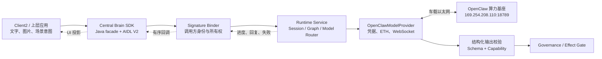
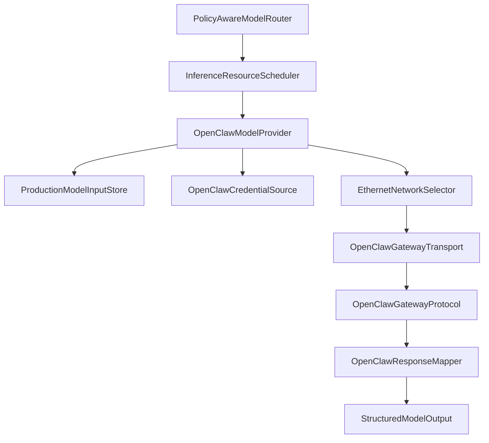
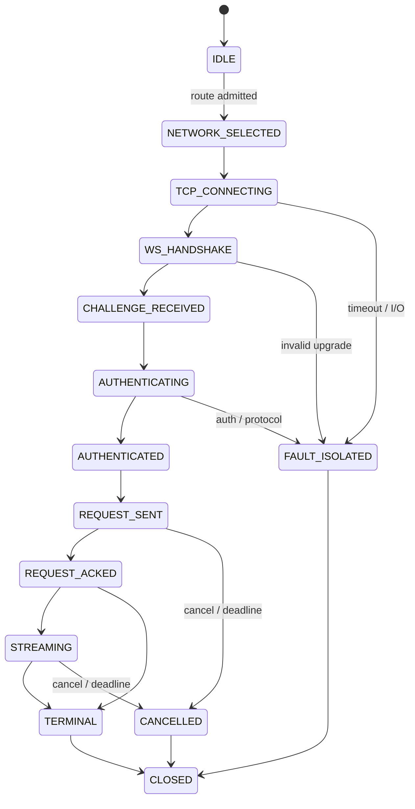
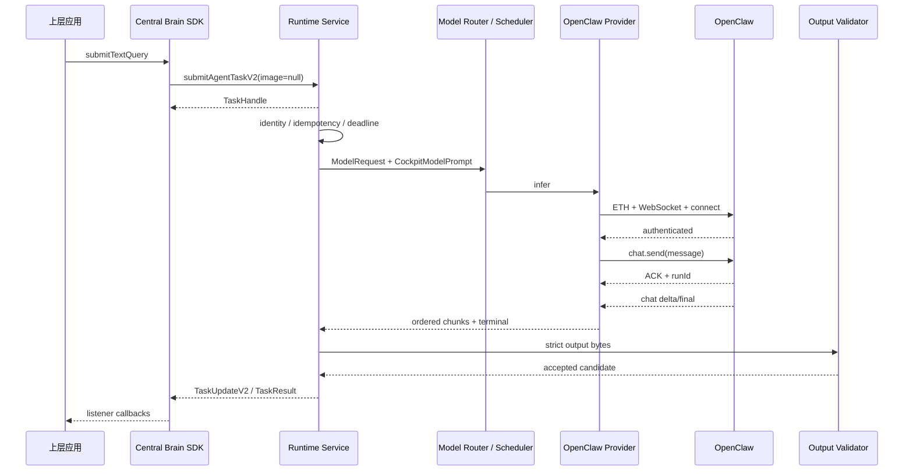
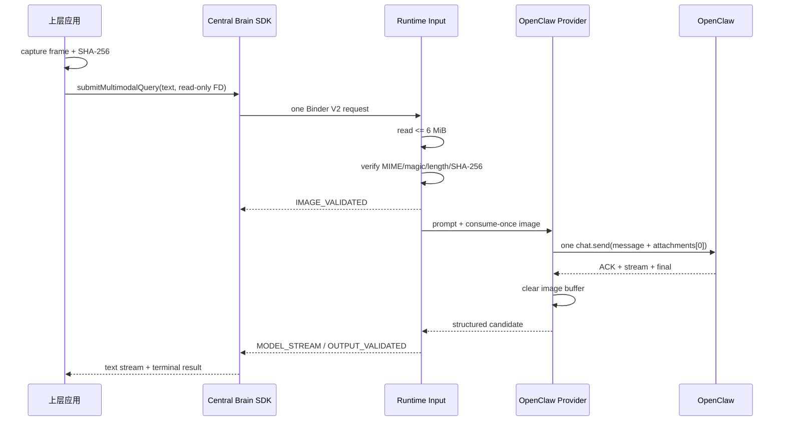
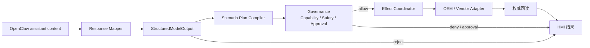

# 上层应用经车载以太网调用 OpenClaw 文字与图片接口详设

> 历史过渡设计：OpenClaw 已退出当前模型调用链路。现行生产目标接口见
> [Android 直连 TY1100 vLLM 生产以太网 API 详设](11b-vllm-production-ethernet-api.md)。本文仅用于迁移追溯，
> 不得作为新版本实现或验收依据。

版本：1.0
适用范围：历史迁移追溯
上级文档：[生产软件开发文档](../CENTRAL_BRAIN_SOFTWARE_DEVELOPMENT.md)

`production_document_scope=false`
`current_production_interface=false`
`module_detailed_design=true`
`production_ready=false`
`target_hardware_validated=false`

## 1. 设计目标与边界

本文定义座舱上层应用如何通过 Central Brain SDK 提交文字或“文字 + 单帧图片”查询，由 Runtime Service
经车载以太网访问外部 OpenClaw 算力基座，并以有序回调接收模型进度、回复和失败结果。本文同时定义：

- 上层 Java API、Binder V2 数据对象和回调语义；
- 图片文件描述符的所有权、尺寸、类型、摘要和生命周期；
- Runtime 内部 `OpenClawModelProvider`、网络选择、WebSocket 和认证边界；
- OpenClaw protocol 3 的 `connect`、`chat.send`、`chat.history` 和 `chat.abort` 交互；
- 文字与图片请求的同一请求绑定、流式回复、结构化输出校验和动作治理；
- 超时、取消、断链、迟到帧、认证失败和输出非法时的失败关闭规则。

### 1.1 生产部署基线

| 项目 | 固定值或规则 |
| --- | --- |
| Android 平台 | Android 13，应用层独立 Runtime Service |
| 物理网络 | Android 座舱域控制器与算力基座之间的车载以太网 |
| 算力基座地址 | `169.254.208.110` |
| OpenClaw 端口 | `18789` |
| 模型 RPC | `ws://169.254.208.110:18789/` |
| 协议版本 | OpenClaw protocol `3` |
| 控制页面 | `/chat`，仅供人工控制页面使用，不是上层应用模型 API |
| 调用进程 | Runtime Service；Client2 和其他上层应用不得直接打开模型网络连接 |
| 认证信息 | 仅由 Runtime 内部 `CredentialSource` 提供，不进入 Binder、日志、Event 或 HMI |
| 最大图片数 | 每个请求最多 1 张 |
| 图片格式 | `image/png`、`image/jpeg` |
| 图片上限 | `6 MiB` |
| 连接超时 | `3000 ms` |
| 请求总时限 | 不超过调用方 deadline，且最长 `120000 ms` |
| 当前发布结论 | 接口详设已定义，release Provider 与量产准入尚未完成 |

### 1.2 信任边界



上层应用只提交业务输入并消费结果，不承担以下职责：

- 不持有 OpenClaw host、port、protocol 或凭据；
- 不建立 TCP/WebSocket 连接；
- 不拼装 `connect` 或 `chat.send` JSON；
- 不决定 Provider、模型、重试或 fallback；
- 不把模型返回的动作直接发送给车辆；
- 不把 `/chat` 页面当作程序接口。

### 1.3 已有代码与待实现内容

| 层级 | 当前状态 | 本详设要求 |
| --- | --- | --- |
| Binder V1 | 已有文字 `AgentTaskRequest` | 保持兼容，只用于文字任务 |
| Binder V2 | 尚无正式图片字段 | 新增独立 V2 DTO、回调和提交方法 |
| 图片传输 | 尚无生产入口 | 使用只读 `ParcelFileDescriptor`，禁止 Binder `byte[]` |
| Provider SPI | 已有 `ModelProvider` | 新增 release `OpenClawModelProvider` 实现 |
| 端点合同 | 已有固定 host/port/protocol | 只能由受控构建配置选择，禁止 HMI 覆盖 |
| 网络权限 | 已有 `INTERNET` 和定向明文策略 | 补充 Ethernet Network 选择与状态监听 |
| Prompt | 已有座舱角色和动作白名单 | 请求必须绑定 context、scenario 和 capability digest |
| 输出校验 | 已有 provider-neutral 严格 Schema | OpenClaw 内容必须映射后再校验 |
| release 组合 | 当前失败关闭 | Provider、Router 和 Orchestration 完成准入后方可启用 |

本文中标记为“新增”的类、AIDL 和方法是目标实现，不代表当前 `main` 已经具备该生产能力。

## 2. 需求映射

| Req ID | 本模块责任 |
| --- | --- |
| `APP-001` | 上层应用通过受控 SDK/Binder 提交场景任务 |
| `APP-002` | 单帧图片与文字绑定同一多模态请求 |
| `APP-004` | 注入汽车座舱角色、服务目标、上下文和动作边界 |
| `APP-005` | HMI 接收输入、模型流式回复、终态和动作链路 |
| `S2-MDL-001` | Provider 生命周期、推理、流式、取消、指标和故障 |
| `S2-MDL-002` | Router 按模态、隐私、网络、健康和资源选择 Provider |
| `S2-MDL-003` | OpenClaw 过渡 Provider 与后续模型底座替换隔离 |
| `S2-MDL-004` | 模型输出严格 Schema 与 capability 白名单 |
| `S2-MDL-005` | 断链、超时、非法回复和取消时阻止 Effect |
| `S2-MDL-006` | 凭据、原始图片和模型原始内容不进入日志 |
| `S2-OBS-001` | 记录有界阶段、时延、字节数、摘要和失败码 |
| `S2-OBS-002` | 通过 request/session/run ID 建立端到端关联 |
| `S2-SAF-001` | 模型只生成候选，Governance 保持唯一动作准入点 |
| `S2-HMI-006` | 实时展示模型输入、回复和调用阶段 |

## 3. 源码地图

### 3.1 当前源码

| 代码路径 | 关键符号 | 设计责任 |
| --- | --- | --- |
| [AgentTaskRequest.aidl](../../central-brain/android-runtime/central-brain-sdk/src/main/aidl/com/centralbrain/sdk/production/AgentTaskRequest.aidl) | `AgentTaskRequest` | 现有文字请求 V1 |
| [ICentralBrainRuntime.aidl](../../central-brain/android-runtime/central-brain-sdk/src/main/aidl/com/centralbrain/sdk/production/ICentralBrainRuntime.aidl) | `submitAgentTask`、version/hash | 生产 Binder 服务入口 |
| [ICentralBrainTaskCallback.aidl](../../central-brain/android-runtime/central-brain-sdk/src/main/aidl/com/centralbrain/sdk/production/ICentralBrainTaskCallback.aidl) | update/completed/failed | 现有回调合同 |
| [CentralBrainClient.java](../../central-brain/android-runtime/central-brain-sdk/src/main/java/com/centralbrain/sdk/CentralBrainClient.java) | `submitAgentTask`、重连、callback bridge | Java facade |
| [CentralBrainRuntimeService.java](../../central-brain/android-runtime/runtime-service/src/main/java/com/centralbrain/runtime/CentralBrainRuntimeService.java) | Binder stub、admission、deadline、durable task | 服务端入口 |
| [ModelProvider.java](../../central-brain/android-runtime/runtime-service/src/main/java/com/centralbrain/runtime/model/ModelProvider.java) | `infer`、`cancel`、`StreamObserver` | Provider SPI |
| [ModelContractV2.java](../../central-brain/android-runtime/runtime-service/src/main/java/com/centralbrain/runtime/model/ModelContractV2.java) | request fingerprint、budget、result | provider-neutral 模型合同 |
| [OpenClawEndpointConfig.java](../../central-brain/android-runtime/runtime-service/src/main/java/com/centralbrain/runtime/model/OpenClawEndpointConfig.java) | target host、protocol、timeout | 固定生产过渡端点 |
| [CockpitModelPrompt.java](../../central-brain/android-runtime/runtime-service/src/main/java/com/centralbrain/runtime/model/CockpitModelPrompt.java) | system/user instruction | 座舱 Prompt |
| [StructuredModelOutput.java](../../central-brain/android-runtime/runtime-service/src/main/java/com/centralbrain/runtime/model/StructuredModelOutput.java) | `validate`、`AcceptedOutput` | 结构化输出边界 |
| [AndroidManifest.xml](../../central-brain/android-runtime/runtime-service/src/main/AndroidManifest.xml) | `INTERNET`、signature permissions | 进程权限 |
| [network_security_config.xml](../../central-brain/android-runtime/runtime-service/src/main/res/xml/network_security_config.xml) | target-only cleartext | 过渡网络策略 |
| [OpenClaw target contract](../../central-brain/contracts/central_brain_android_openclaw_target_gateway_v1.json) | endpoint、transport、limits | 机器可读生产合同 |
| [multimodal gateway contract](../../central-brain/contracts/central_brain_android_openclaw_multimodal_gateway_v1.json) | attachment shape、image bounds | 文字与图片合同 |

### 3.2 新增代码清单

| 目标路径 | 目标符号 | 实现责任 |
| --- | --- | --- |
| `central-brain-sdk/src/main/aidl/.../AgentTaskRequestV2.aidl` | `AgentTaskRequestV2` | 文字、场景、上下文和可选图片 |
| `central-brain-sdk/src/main/aidl/.../ModelImageAttachment.aidl` | `ModelImageAttachment` | 图片 FD、MIME、长度、SHA-256 |
| `central-brain-sdk/src/main/aidl/.../TaskUpdateV2.aidl` | `TaskUpdateV2` | 有类型的流式阶段和模型增量 |
| `central-brain-sdk/src/main/aidl/.../ICentralBrainTaskCallbackV2.aidl` | V2 callback | 有序 update、completed、failed |
| `central-brain-sdk/src/main/java/.../TextQuery.java` | SDK DTO | 上层文字查询 |
| `central-brain-sdk/src/main/java/.../MultimodalQuery.java` | SDK DTO | 上层文字与图片查询 |
| `runtime-service/src/main/java/.../ProductionModelInputStore.java` | consume-once input | 有界读取、摘要、清零和所有权 |
| `runtime-service/src/main/java/.../OpenClawGatewayProtocol.java` | frame codec | protocol 3 JSON 与状态机 |
| `runtime-service/src/main/java/.../OpenClawGatewayTransport.java` | Ethernet transport | Network、Socket、RFC 6455、deadline |
| `runtime-service/src/main/java/.../OpenClawCredentialSource.java` | credential lease | 受控认证信息供应 |
| `runtime-service/src/main/java/.../OpenClawResponseMapper.java` | wire-to-canonical | OpenClaw 内容到统一输出 Schema |
| `runtime-service/src/release/java/.../OpenClawModelProvider.java` | Provider 实现 | SPI、流式、取消、metrics、fault |
| `runtime-service/src/release/java/.../ModelProviderFactory.java` | release composition | Provider 注册和 readiness gate |

新增类必须放在上述职责边界内。协议 codec 不得依赖 HMI，SDK 不得依赖 Socket，Provider 不得直接调用
Vehicle Adapter。

## 4. 核心设计

### 4.1 对外 API 版本策略

现有 V1 必须保持 ABI 行为，不在 `AgentTaskRequest` 尾部直接追加图片大对象。生产多模态能力采用增量 V2：

1. `ICentralBrainRuntime.INTERFACE_VERSION` 升级为 `2`，重新生成并冻结 interface hash。
2. 保留 `submitAgentTask(AgentTaskRequest, callback)`，旧调用方继续提交文字任务。
3. 在接口末尾新增 `submitAgentTaskV2(AgentTaskRequestV2, ICentralBrainTaskCallbackV2)`。
4. SDK 连接后先读取 version/hash；version 小于 2 时拒绝图片请求，不降级为丢图文字请求。
5. V2 调用方不得调用 V1 后再单独上传图片，两次 Binder 调用不能组成同一模型请求。

建议 AIDL 结构：

```aidl
parcelable ModelImageAttachment {
    int schemaVersion = 1;
    String attachmentId = "";
    String mimeType = "";
    String fileName = "";
    long byteCount = 0;
    String sha256 = "";
    long capturedAtElapsedRealtimeMs = 0;
    ParcelFileDescriptor contentFd;
}

parcelable AgentTaskRequestV2 {
    int schemaVersion = 2;
    String clientRequestId = "";
    String sessionId = "";
    String scenarioHint = "";
    String utterance = "";
    String locale = "";
    long deadlineElapsedRealtimeMs = 0;
    int priority = 0;
    String idempotencyKey = "";
    String contextDigest = "";
    ModelImageAttachment image;
}
```

`scenarioHint` 只是允许列表中的候选，不允许调用方借此绕过 Scenario Resolver。`contextDigest` 绑定 Runtime
已经形成的 ContextSnapshot；上层应用不能通过自定义字符串替换可信车辆上下文。

### 4.2 Java facade

上层应用只使用 SDK facade：

```java
TaskHandle submitTextQuery(TextQuery query, TaskListener listener);

TaskHandle submitMultimodalQuery(
        MultimodalQuery query,
        TaskListener listener);

boolean cancelTask(TaskHandle handle, CancelReason reason);
```

`TextQuery` 映射为 V2 且 `image=null`；`MultimodalQuery` 必须同时包含非空文字和一张图片。SDK 在 Binder
调用前校验：

- ID、locale、priority、deadline、幂等键和文本长度；
- 图片 MIME、声明长度、SHA-256 格式和只读 FD；
- SDK/Service protocol version/hash；
- 回调 executor 非 Binder 主线程；
- 同一 `CentralBrainClient` 中 `clientRequestId` 不重复占用。

SDK 不读取图片全文，不计算模型 Prompt，不记录原始输入，也不执行网络重试。

### 4.3 图片 FD 与所有权

图片不得放入 AIDL `byte[]`、`Bundle` 或 Base64 字符串。正确流程为：

1. 上层应用从相机帧或受控媒体源生成 PNG/JPEG。
2. 上层应用打开只读 `ParcelFileDescriptor`，读取文件元数据并计算 SHA-256。
3. SDK 将 FD 和元数据随 `AgentTaskRequestV2` 一次提交。
4. Binder 返回后，上层应用关闭自己的 FD；远端进程持有独立描述符。
5. Runtime 在专用输入 executor 中顺序读取，最多 `6 MiB`，边读边计算摘要。
6. 声明长度、实际长度、摘要、MIME 与文件 magic 任一不一致即拒绝。
7. Runtime 将字节绑定到 `inputDigest`，仅允许对应任务消费一次。
8. Provider 完成 Base64 编码或请求失败后立即覆盖内存并释放 FD。

Runtime 不把原始图片写入持久化数据库、日志、Event payload 或诊断页。发生进程死亡时，任务恢复只保留
摘要和失败状态；不得从不受控路径重新打开旧图片。

### 4.4 请求身份和指纹

每个任务至少存在五个相关标识：

| 标识 | 生成方 | 用途 |
| --- | --- | --- |
| `clientRequestId` | 上层应用 | 调用方本地关联 |
| `taskId` | Runtime | Binder 任务和持久化主键 |
| `requestId` | Model Runtime | Provider 推理请求 |
| `sessionKey` | Runtime | OpenClaw 会话隔离 |
| `runId` | OpenClaw | 当前模型运行实例 |

推荐指纹：

```text
inputDigest =
  SHA256(utteranceBytes || 0x00 || imageSha256 || 0x00 || contextDigest)

requestFingerprint =
  SHA256(schemaVersion | sessionId | scenarioId | inputDigest |
         contextDigest | scenarioCatalogDigest | capabilityCatalogDigest |
         privacyClass | deadlineElapsedRealtimeMs)
```

`sessionKey` 必须由受控前缀和 `inputDigest` 派生；`idempotencyKey` 必须稳定映射当前 `requestId`。任何
`sessionKey`、`runId`、`requestId` 或 fingerprint 不匹配的响应帧都视为旁路数据并丢弃。

### 4.5 座舱 Prompt

Runtime 使用 `CockpitModelPrompt` 形成 provider-neutral 输入：

```text
system:
  角色 = 汽车座舱 AIOS 场景规划器
  目标 = 服务驾驶员和乘员
  权限 = 只能提出候选动作，不能宣称已经执行
  安全 = 只使用允许能力，不绕过 Governance
  图像 = 只分析直接可见事实，不做人身身份或敏感属性推断
  输出 = 单个严格 JSON 对象

user:
  utterance
  scenarioId
  bounded ContextSnapshot
  allowedActions
  requiredActions
```

图片本身通过 `attachments` 发送，Prompt 中只保存 `image_present`、MIME、尺寸和摘要，不重复嵌入 Base64。
模型看到的 context 必须来自 Runtime Context Builder，不接受上层应用提供的自由文本车辆状态。

### 4.6 Provider 内部结构



`OpenClawModelProvider` 实现现有 `ModelProvider`：

- `descriptor()`：backend=`OPENCLAW_GATEWAY`，初始最大并发为 `1`；
- `snapshot()`：返回 lifecycle、health、active、queued 和 fault isolation；
- `warmup()`：只完成网络/协议能力探测，不发送用户内容；
- `infer()`：取得调度 lease、消费输入、执行协议并投递有序 chunk/terminal；
- `cancel()`：发送 `chat.abort`，并在本地立即阻止后续 chunk；
- `metrics()`：只返回计数、时延、字节数和安全失败码；
- `lastFault()`：不包含凭据、Prompt、图片、原始回复或 Socket 内容；
- `close()`：取消活动请求、清空输入、关闭 Socket 和 executor。

### 4.7 车载以太网选择

Runtime 使用 `ConnectivityManager` 选择包含 `TRANSPORT_ETHERNET` 且 `LinkProperties` 能路由到目标地址的
`Network`。不要使用进程级 `bindProcessToNetwork`，应通过选定 `Network` 的 `SocketFactory` 创建本请求
Socket，避免影响 Runtime 的其他网络业务。

生产 APK 需要：

```xml
<uses-permission android:name="android.permission.INTERNET" />
<uses-permission android:name="android.permission.ACCESS_NETWORK_STATE" />
```

网络准入顺序：

1. 枚举 Ethernet `Network`。
2. 检查目标 IPv4 路由、接口状态和 MTU。
3. 拒绝 VPN、蜂窝或 Wi-Fi 代替指定车载链路。
4. 用该 `Network` 创建 TCP Socket 并连接 `169.254.208.110:18789`。
5. 注册网络丢失回调；丢失时取消当前请求并把 Provider 标记为 degraded。
6. 路由恢复后只恢复 Provider health，不自动重放未确认请求。

目标地址、接口 IPv4 和路由由 OEM 网络配置持有。应用层不能在每次启动时临时修改系统网卡配置，也不能
把“端口可连接”解释为完整的生产网络资格。

当前 `ws` 为定向明文过渡合同。网络策略只允许目标地址，禁止全局 cleartext。算力基座支持后应迁移
`wss` 或 mTLS；迁移只替换 Transport/Credential，不改变 SDK、Graph 或 Effect 合同。

### 4.8 凭据

目标实现必须引入：

```java
interface OpenClawCredentialSource {
    CredentialLease acquire(String providerId, long deadlineElapsedRealtimeMs);
}
```

`CredentialLease` 只暴露短生命周期字符或字节缓冲，使用后覆盖。不得提供 `String toString()`，不得出现在
异常链、metrics、Binder、Event、HMI 或 crash 附件中。

当前过渡配置仍存在可从 APK 提取的固定凭据，这是发布风险。接口文档不复制该值。即使项目阶段要求保留
固定凭据，也只能由 Runtime 构建所有者读取；上层应用仍不得传入或覆盖认证信息，并且
`production_ready` 必须保持 `false`，直到 secret owner 和轮换机制完成。

### 4.9 连接状态机



每个有效请求最多产生一个 terminal。terminal 或 cancel 之后收到的帧只计入 late-frame metric，不投递给
上层应用。

## 5. 接口与数据

### 5.1 上层文字请求

```java
TextQuery query = new TextQuery.Builder()
        .clientRequestId(clientRequestId)
        .sessionId(sessionId)
        .utterance("我有些疲惫")
        .locale("zh-CN")
        .priority(2)
        .deadlineElapsedRealtimeMs(deadline)
        .idempotencyKey(idempotencyKey)
        .build();

TaskHandle handle = centralBrainClient.submitTextQuery(query, listener);
```

文字必须是有效 UTF-8 语义字符串，去除首尾空白后非空。SDK 不允许调用方把 JSON、认证字段或 endpoint
override 作为扩展字段传给 Runtime。

### 5.2 上层图片与文字请求

```java
try (ParcelFileDescriptor imageFd =
        contentResolver.openFileDescriptor(imageUri, "r")) {
    ModelImage image = new ModelImage.Builder()
            .attachmentId(attachmentId)
            .mimeType("image/png")
            .fileName("cabin-frame.png")
            .byteCount(imageBytes)
            .sha256(imageSha256)
            .capturedAtElapsedRealtimeMs(captureTime)
            .contentFd(imageFd)
            .build();

    MultimodalQuery query = new MultimodalQuery.Builder()
            .clientRequestId(clientRequestId)
            .sessionId(sessionId)
            .scenarioHint("scene.cabin.multimodal.assist.v1")
            .utterance("处理一下")
            .locale("zh-CN")
            .priority(2)
            .deadlineElapsedRealtimeMs(deadline)
            .idempotencyKey(idempotencyKey)
            .contextDigest(contextDigest)
            .image(image)
            .build();

    handle = centralBrainClient.submitMultimodalQuery(query, listener);
}
```

图片元数据限制：

| 字段 | 规则 |
| --- | --- |
| `attachmentId` | `[A-Za-z0-9._:-]{1,128}`，当前请求内唯一 |
| `mimeType` | 只能是 `image/png` 或 `image/jpeg` |
| `fileName` | 只用于协议展示，去路径化，最长 128 字符 |
| `byteCount` | `1..6291456` |
| `sha256` | 64 位小写十六进制 |
| `capturedAtElapsedRealtimeMs` | 不晚于提交时间，不早于允许的帧新鲜度 |
| `contentFd` | 非空、只读、提交后由两端各自关闭 |

### 5.3 OpenClaw 连接认证

RFC 6455 握手完成后，Runtime 先等待：

```json
{
  "type": "event",
  "event": "connect.challenge",
  "payload": {
    "nonce": "<server-nonce>"
  }
}
```

随后发送：

```json
{
  "type": "req",
  "id": "<connect-request-id>",
  "method": "connect",
  "params": {
    "minProtocol": 3,
    "maxProtocol": 3,
    "client": {
      "id": "openclaw-control-ui",
      "version": "<release-version>",
      "platform": "android",
      "mode": "webchat"
    },
    "role": "operator",
    "scopes": [
      "operator.read",
      "operator.write"
    ],
    "caps": [],
    "auth": {
      "token": "<credential-from-runtime-owner>"
    },
    "locale": "zh-CN",
    "userAgent": "CougarOS-Android/<release-version>"
  }
}
```

只接受匹配 `id`、`ok=true` 且 `payload.protocol=3` 的响应。nonce 不得为空；认证响应之前的普通帧上限为
`65536 bytes`。

### 5.4 文字 `chat.send`

```json
{
  "type": "req",
  "id": "<rpc-request-id>",
  "method": "chat.send",
  "params": {
    "sessionKey": "agent:main:cougaros-<digest-prefix>",
    "message": "<bounded-cockpit-prompt>",
    "deliver": false,
    "idempotencyKey": "<stable-request-uuid>"
  }
}
```

### 5.5 图片与文字 `chat.send`

图片和文字必须位于同一个 `chat.send`：

```json
{
  "type": "req",
  "id": "<rpc-request-id>",
  "method": "chat.send",
  "params": {
    "sessionKey": "agent:main:cougaros-<digest-prefix>",
    "message": "<bounded-cockpit-prompt>",
    "deliver": false,
    "idempotencyKey": "<stable-request-uuid>",
    "attachments": [
      {
        "type": "image",
        "mimeType": "image/png",
        "fileName": "cabin-frame.png",
        "content": "<base64-image>"
      }
    ]
  }
}
```

Base64 只存在于 Runtime 到 OpenClaw 的 WebSocket 帧中。认证后的多模态帧上限为 `8500000 bytes`；
Provider 必须在编码前计算最坏帧大小，超过上限则拒绝，不能截断图片。

### 5.6 ACK、流式事件和终态

ACK：

```json
{
  "type": "res",
  "id": "<rpc-request-id>",
  "ok": true,
  "payload": {
    "runId": "<openclaw-run-id>"
  }
}
```

流式或终态：

```json
{
  "type": "event",
  "event": "chat",
  "payload": {
    "sessionKey": "agent:main:cougaros-<digest-prefix>",
    "runId": "<openclaw-run-id>",
    "state": "delta",
    "message": {
      "content": "<cumulative-or-delta-text>"
    }
  }
}
```

`state` 只接受 `delta`、`final` 或 `error`。Provider 必须兼容累计文本和增量文本，但对 SDK 输出统一为
单调 `sequence`。`error` 立即形成 terminal failure。

### 5.7 历史回查和取消

只在 ACK/终态先后顺序不确定，或 final 不含可用内容时执行：

```json
{
  "type": "req",
  "id": "<history-request-id>",
  "method": "chat.history",
  "params": {
    "sessionKey": "<current-session-key>",
    "limit": 6
  }
}
```

回查结果必须能找到与当前完整 `message` 匹配的 user 项以及其后的 assistant 项，否则拒绝，不得取会话中
最近一条不相关回复。

取消：

```json
{
  "type": "req",
  "id": "<abort-request-id>",
  "method": "chat.abort",
  "params": {
    "sessionKey": "<current-session-key>",
    "runId": "<current-run-id>"
  }
}
```

本地取消状态比 `chat.abort` ACK 更权威：一旦调用方取消或 deadline 到期，SDK 不再接收模型增量，且
Governance/Effect 不得继续。

### 5.8 模型内容 Schema

OpenClaw 外层 frame 只负责传输。assistant 内容必须最终变为统一结构：

```json
{
  "scenarioId": "scene.fatigue.assist.v1",
  "parameters": [
    {
      "capabilityId": "hvac.temperature.set",
      "area": "ROW1",
      "value": "24.0"
    }
  ],
  "summary": "已形成舒适调节候选，等待策略确认。"
}
```

`OpenClawResponseMapper` 必须完成 wire 内容到该 Schema 的显式映射，再调用
`StructuredModelOutput.validate()`。现有 OpenClaw 动作列表形态与 provider-neutral 参数形态不一致；
release 实现不得直接把前者送入 Effect，也不得绕过统一校验。长期方案是让 Prompt 直接约束模型输出统一
Schema，Mapper 只做外层解包。

### 5.9 SDK 更新事件

V2 `TaskUpdate` 推荐字段：

```text
schemaVersion, taskId, state, phase, progressPercent, sequence,
displayText, providerId, inputDigest, outputDigest, elapsedMs
```

`phase` 允许值：

| Phase | HMI 含义 |
| --- | --- |
| `INPUT_ACCEPTED` | 文字/图片已被 Runtime 接收 |
| `IMAGE_VALIDATED` | MIME、长度、magic 和 SHA-256 通过 |
| `ROUTE_SELECTED` | 已选择 OpenClaw Provider |
| `ETH_CONNECTING` | 正在通过车载以太网连接算力基座 |
| `MODEL_AUTHENTICATED` | 协议和认证通过 |
| `MODEL_REQUEST_SENT` | 同一文字或多模态请求已发送 |
| `MODEL_STREAM` | 有界模型文本增量 |
| `MODEL_TERMINAL` | 模型回复结束 |
| `OUTPUT_VALIDATED` | 结构化输出校验通过 |
| `PLAN_READY` | 候选计划已形成，尚未授权执行 |
| `FAILED` | 失败码已生成 |
| `CANCELLED` | 调用方、deadline 或 policy 已取消 |

HMI 可展示调用方原本拥有的文字和缩略图；Runtime 回调只回传摘要与模型文本，不回传原始图片副本。

### 5.10 错误映射

| Provider/Transport 失败 | Binder V2 错误 | retryable | Effect |
| --- | --- | --- | --- |
| `CREDENTIAL_UNAVAILABLE` | `ERROR_MODEL_AUTH_UNAVAILABLE` | false | blocked |
| `HANDSHAKE_REJECTED` | `ERROR_MODEL_PROTOCOL` | false | blocked |
| `PROTOCOL_REJECTED` | `ERROR_MODEL_PROTOCOL` | false | blocked |
| `AUTHENTICATION_REJECTED` | `ERROR_MODEL_AUTH_REJECTED` | false | blocked |
| `DEADLINE_EXCEEDED` | `ERROR_DEADLINE_EXCEEDED` | false | blocked |
| `CANCELLED` | `ERROR_CANCELLED` | false | blocked |
| `SCENARIO_BINDING_REJECTED` | `ERROR_MODEL_OUTPUT_REJECTED` | false | blocked |
| `REPLY_BOUNDS_REJECTED` | `ERROR_MODEL_OUTPUT_REJECTED` | false | blocked |
| `ACTION_ALLOWLIST_REJECTED` | `ERROR_MODEL_OUTPUT_REJECTED` | false | blocked |
| `STRUCTURED_OUTPUT_REJECTED` | `ERROR_MODEL_OUTPUT_REJECTED` | false | blocked |
| `TRANSPORT_FAILURE` | `ERROR_MODEL_NETWORK` | true，仅限新请求 | blocked |
| `INTERNAL_GATEWAY_FAILURE` | `ERROR_INTERNAL` | false | blocked |

V2 错误码必须追加，不能改变 V1 现有数值。`retryable=true` 只表示上层可以发起一个具有新
`clientRequestId` 的新任务，不允许 Runtime 在未知服务器状态下自动重放当前 `chat.send`。

## 6. 关键流程

### 6.1 文字查询



### 6.2 图片与文字查询



### 6.3 模型回复到车辆动作



模型回复本身不能证明空调、座椅、购物或导航已经执行。只有 Adapter 权威回读可以形成
`VERIFIED_SUCCESS`；没有车辆通信合同时必须显示 `unknown` 或明确的 UI 反馈状态。

### 6.4 服务重启

Runtime 重启后：

1. 从 DurableTaskRepository 恢复 task 元数据。
2. 已提交但无 terminal 的网络请求标记为 `UNKNOWN_REMOTE_STATE`。
3. 不恢复原始图片，不重新发送 `chat.send`。
4. 若原请求仍有 session/run 证据，只允许有界 `chat.history` 读取终态。
5. 不能证明当前回复与 request fingerprint 一致时，任务失败关闭。

## 7. 失败关闭与并发

### 7.1 并发模型

- OpenClaw 过渡 profile 初始 `maxConcurrentRequests=1`。
- 每个活动请求使用独立 WebSocket，避免多 run 复用连接时的帧串扰。
- Router/Scheduler 在连接前取得 provider slot；关闭 Socket 后才释放。
- 输入存储最多保留 2 个待消费图片，总字节不超过 `12 MiB`。
- Binder 回调为 `oneway`；Runtime 通过单任务串行 executor 保证 sequence 单调。
- HMI 回调阻塞、死亡或抛错不能阻塞网络读取线程。

### 7.2 Deadline

统一使用 `SystemClock.elapsedRealtime()`：

```text
remaining =
  request.deadlineElapsedRealtimeMs - SystemClock.elapsedRealtime()

socketConnectTimeout = min(3000, remaining)
socketReadTimeout = min(120000, remaining)
```

排队、图片校验、网络连接、认证、推理、输出校验共享同一 deadline。每进入一个阶段都重新计算 remaining；
remaining 小于等于零立即取消。

### 7.3 失败关闭规则

- 无 Ethernet 路由：不打开 Socket，不回退到其他物理网络。
- 认证信息不可用：Provider `UNAVAILABLE`，不发送空 token。
- 握手、协议或认证失败：隔离当前 Provider，不自动改用未知后端。
- 图片校验失败：不发送文字部分，整个多模态请求失败。
- ACK 未知：不自动重发相同 `chat.send`。
- `sessionKey`/`runId` 不匹配：丢弃并计入关联失败。
- frame、reply、字段或数组超限：关闭连接并生成安全失败码。
- 模型输出非法：不进入 repair 后直接执行；任何 repair 结果仍需完整复验。
- 调用方死亡：取消其所有活动任务，关闭 FD 和 Socket。
- 网络丢失：发送 best-effort abort，随后本地终止。
- terminal 后迟到数据：不回调、不持久化、不进入 Event。

### 7.4 可观察字段

允许：

```text
taskId, requestId, sessionDigest, runDigest, providerId, phase,
inputTextBytes, imageBytes, imageSha256, frameCount, responseBytes,
connectMs, authMs, firstTokenMs, totalMs, failureCode
```

禁止：

```text
credential, raw utterance, raw prompt, raw image, Base64 image,
raw assistant response, vehicle payload, personal identity data
```

其中 `imageSha256` 仅用于完整性和关联，不得作为跨用户画像标识长期保留。

## 8. 代码校对清单

### 8.1 SDK 与 Binder

- [ ] V1 AIDL transaction 与错误码数值保持不变。
- [ ] V2 interface version/hash 已冻结并有兼容性检查。
- [ ] 文字查询与多模态查询都只调用一次 Binder submit。
- [ ] 图片通过只读 `ParcelFileDescriptor`，没有 Binder 大字节数组。
- [ ] 旧 Runtime 收到图片请求时明确报 capability unavailable。
- [ ] callback sequence 单调，terminal 最多一次。
- [ ] Binder death 会取消任务并释放 FD。
- [ ] 上层应用不能传入 endpoint、protocol、token 或 Provider ID。

### 8.2 输入

- [ ] MIME allowlist 只有 PNG/JPEG。
- [ ] magic、声明长度、实际长度和 SHA-256 同时校验。
- [ ] 单图上限 6 MiB，待处理总量上限 12 MiB。
- [ ] 图片与文字共享 inputDigest/requestFingerprint。
- [ ] 图片只能消费一次，完成后覆盖缓冲。
- [ ] 原始图片不进入 Room、Event、日志和诊断。
- [ ] 捕获时间和任务提交时间满足帧新鲜度。

### 8.3 网络与协议

- [ ] APK 具有 `INTERNET` 和 `ACCESS_NETWORK_STATE`。
- [ ] 只选择可路由目标地址的 Ethernet `Network`。
- [ ] Socket 由该 `Network` 的 `SocketFactory` 创建。
- [ ] 连接只指向 `169.254.208.110:18789`。
- [ ] `/chat` 未被当作模型 RPC。
- [ ] RFC 6455 握手有 header、status、frame 和 masking 校验。
- [ ] 必须先收到 `connect.challenge` 再认证。
- [ ] protocol 必须精确等于 3。
- [ ] `chat.send` 必须携带 session 和 idempotency key。
- [ ] 图片和文字位于同一 `chat.send`。
- [ ] ACK、delta、final、history、abort 均绑定当前请求。
- [ ] 多模态 frame 不超过 8,500,000 bytes。
- [ ] terminal 后不再交付 frame。

### 8.4 Provider 与模型

- [ ] `OpenClawModelProvider` 覆盖 SPI 全生命周期。
- [ ] descriptor、snapshot、metrics 和 fault 与实际状态一致。
- [ ] Provider assurance 未经资格评审不得声明 `PRODUCTION`。
- [ ] Prompt 含座舱角色、服务目标、上下文和动作白名单。
- [ ] OpenClaw wire 内容映射为统一输出 Schema。
- [ ] `StructuredModelOutput.validate()` 是唯一接受入口。
- [ ] 接受输出仍不授予 action/approval/effect 权限。
- [ ] 取消和 deadline 传播到 provider、graph 和 callback。

### 8.5 安全与发布

- [ ] 凭据只来自 Runtime `CredentialSource`。
- [ ] 凭据不进入 source display、Binder、日志、Event、HMI 和异常。
- [ ] 网络安全配置没有开启全局 cleartext。
- [ ] 输入输出只保留生产所需的最小期限。
- [ ] Parser 已覆盖超深、超长、重复字段、未知字段和畸形 UTF-8。
- [ ] release 组合没有固定成功、旁路校验或静默 fallback。
- [ ] 目标网络、算力基座、签名、隐私和凭据 owner 已签署准入。

## 9. 增量开发规则

### 9.1 阶段 A：公共合同

1. 新增 V2 AIDL DTO、callback 和 append-only submit 方法。
2. 新增 SDK `TextQuery`、`MultimodalQuery` 和 builder 校验。
3. 更新 protocol version/hash 和兼容性用例。
4. 保持 V1 路径不变。

完成条件：文字 V1 不回归，V2 文字可提交，图片通过 FD 完整传入 Runtime。

### 9.2 阶段 B：输入边界

1. 实现 `ProductionModelInputStore`。
2. 实现有界读取、MIME/magic/SHA-256 校验。
3. 实现 consume-once、任务取消清理和进程关闭清理。
4. 将 inputDigest 绑定 ContextSnapshot 和场景。

完成条件：非法图片在网络前被拒绝，合法图片没有持久化副本。

### 9.3 阶段 C：OpenClaw Provider

1. 实现 Ethernet `Network` 选择。
2. 实现 RFC 6455 Transport 和 protocol 3 codec。
3. 实现 `connect`、`chat.send`、流式、history 和 abort。
4. 实现 `OpenClawResponseMapper` 和统一输出校验。
5. 实现 metrics、fault isolation、deadline 和 cancel。

完成条件：Provider 单独满足文字、多模态、断链、超时、取消和非法响应合同。

### 9.4 阶段 D：release 组合

1. 将 Provider 注册到 `ModelProviderRegistry`。
2. 配置 Router 的 privacy/network/assurance policy。
3. 将 Model terminal 接入 Graph 节点和 TaskUpdateV2。
4. 保持 Governance/Effect 失败关闭。
5. 在 release factory 中移除对应的未装配 blocker。

完成条件：上层应用可看到完整调用阶段，模型候选只能经 Governance 进入 Plan/Effect。

### 9.5 阶段 E：生产准入

1. 完成 Ethernet 静态配置和重启后路由资格。
2. 完成凭据所有者、轮换和泄露处置。
3. 完成目标模型文字/图片能力、协议和负载资格。
4. 完成隐私、日志、故障矩阵、时延和长稳验收。
5. 完成 `wss`/mTLS 迁移计划或正式风险接受。

仅在所有 owner 证据齐备后，才允许把 Provider assurance、`production_ready` 和
`target_hardware_validated` 提升为 true。

## 10. 当前缺口

- `AgentTaskRequestV2`、`ModelImageAttachment` 和 V2 callback 尚未进入生产 SDK。
- Runtime 生产 Binder 目前只接收文字，尚无正式图片 FD 入口。
- release 源集尚无 `OpenClawModelProvider`、Ethernet Transport 和协议 codec。
- release Orchestration factory 仍返回失败关闭 backend，生产模型路由未激活。
- 当前固定凭据可从 APK 提取，尚无受控 secret owner 和轮换实现。
- 当前为 `ws` 明文过渡链路，尚未完成 `wss` 或 mTLS。
- OpenClaw 动作列表与 provider-neutral 参数 Schema 需要统一或显式 mapper。
- 目标 Ethernet IPv4/路由持久化、断链恢复和网络 owner 资格尚未闭环。
- 模型能力、隐私、负载、长稳和目标发布证据尚不支持 `PRODUCTION` assurance。
- `production_ready=false`，`target_hardware_validated=false`。
