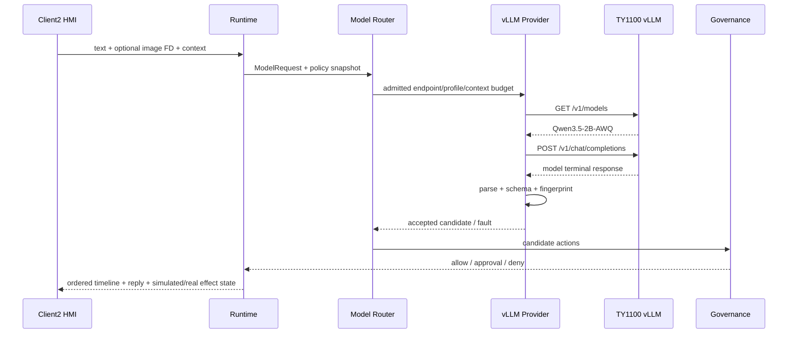

# Android 直连 TY1100 vLLM 生产以太网 API 详设

版本：1.0
适用范围：Android 13 生产目标软件
上级文档：[生产软件开发文档](../CENTRAL_BRAIN_SOFTWARE_DEVELOPMENT.md)
关联需求：`S2-MDL-001..005`、`S2-OBS-001/002`、`P4-R13`

`production_document_scope=true`
`target_model_integration_validated=true`
`production_ready=false`
`target_hardware_validated=false`

## 1. 设计目标

本文定义 Android 13 座舱域控制器通过车载以太网直接访问 TY1100 模型服务的生产目标接口。该链路替代
OpenClaw 中间层，由 Central Brain 自己完成 Provider 路由、模型身份检查、文字/图文请求组装、输出校验、
可观测性和失败关闭。

模型服务只提供推理能力，不获得 Tool、Effect、车辆总线或审批权限。任何模型输出必须回到 Android
Runtime，经本地 Schema、白名单、Governance 和审批链处理。

## 2. 固定部署合同

| 项目 | 固定值 |
| --- | --- |
| Android 生产网口 | `eth0` |
| Android 当前地址 | `169.254.202.100/24` |
| TY1100 地址 | `169.254.202.110` |
| 服务端口 | `8000` |
| Base URL | `http://169.254.202.110:8000` |
| 模型目录 | `GET /v1/models` |
| 推理接口 | `POST /v1/chat/completions` |
| 接口语义 | OpenAI-compatible Chat Completions |
| 当前唯一 served model | `Qwen3.5-2B-AWQ` |
| arbitrary endpoint override | 禁止 |
| ADB reverse / WSL bridge | 生产链路禁止 |
| TY1100 配置修改 | 客户端部署过程禁止 |

机器可读合同见
[central_brain_android_ty1100_ethernet_target_v1.json](../../central-brain/contracts/central_brain_android_ty1100_ethernet_target_v1.json)。

## 3. 软件边界与源码地图

| 代码路径 | 关键实现 | 责任 |
| --- | --- | --- |
| [VllmEndpointConfig.java](../../central-brain/android-runtime/runtime-service/src/main/java/com/centralbrain/runtime/model/VllmEndpointConfig.java) | `ty1100General2bViaTargetEthernet()`、`ty1100Smoking2bViaTargetEthernet()` | 固定 host、port、model、context 和 timeout |
| [ModelProfileRouter.java](../../central-brain/android-runtime/runtime-service/src/main/java/com/centralbrain/runtime/model/ModelProfileRouter.java) | `SINGLE_2B_TARGET_ETHERNET` | 两个逻辑 Profile 到单物理模型的确定性路由 |
| [VllmInferenceEngine.java](../../central-brain/android-runtime/runtime-service/src/debug/java/com/centralbrain/runtime/model/VllmInferenceEngine.java) | `infer()`、request JSON、Data URL、response parser | 当前 target-integration HTTP/JSON 实现 |
| [DebugDecisionCompositionBoundary.java](../../central-brain/android-runtime/runtime-service/src/debug/java/com/centralbrain/runtime/orchestration/DebugDecisionCompositionBoundary.java) | endpoint/profile 组合 | 当前目标集成组合根 |
| [runtime-service build.gradle.kts](../../central-brain/android-runtime/runtime-service/build.gradle.kts) | `centralBrainTargetTy1100Ethernet` | 固定 BuildConfig 与互斥构建 profile |
| [network_security_config.xml](../../central-brain/android-runtime/runtime-service/src/debug/res/xml/network_security_config.xml) | target host cleartext scope | 当前目标集成网络白名单 |

当前网络执行器仍位于 target-integration 源集。量产 release 必须把等价实现迁入 release 组合根，并完成第 10
章门槛；不能直接把 debug APK 视为量产包。

## 4. Profile 与路由

TY1100 当前只暴露一个 `Qwen3.5-2B-AWQ` 服务，但业务路由仍保留两个逻辑 Profile：

| 逻辑工作负载 | Endpoint Profile | Logical Profile ID | Android context 上限 |
| --- | --- | --- | ---: |
| 通用座舱 | `TY1100_GENERAL_2B_VIA_TARGET_ETHERNET` | `model.general-cockpit.2b.target.v1` | 8192 |
| 吸烟合规图文 | `TY1100_SMOKING_2B_VIA_TARGET_ETHERNET` | `model.cabin-smoking.2b.v1` | 4096 |

两者共享 `169.254.202.110:8000` 不代表可以合并业务身份。`ModelProfileRouter` 必须继续校验场景、能力、
profile ID、内部 model ID、served model、context 上限和健康新鲜度，并把选择结果写入 route digest。
吸烟 Profile 不可用时禁止静默回退到通用 Profile。

## 5. 连接与模型身份门禁

业务推理前执行以下步骤：

1. 绑定获准的车载 Ethernet `Network`；目标集成版本至少确认 `eth0` 路由可达固定 link-local 网段。
2. 以 3000 ms 连接超时调用 `GET /v1/models`。
3. HTTP 状态必须为 2xx，响应体必须是有界 UTF-8 JSON。
4. `data[].id` 必须精确包含且只选择 `Qwen3.5-2B-AWQ`。
5. 对目标 Profile 执行同模态预热；文字 Profile 用结构化文字，视觉 Profile 用文字加有界图片。
6. 只有目录身份和预热同时成功，健康快照才可标记 route-ready。

目录为空、模型名漂移、响应超限、JSON 非法、超时或网络变化时立即撤销 route-ready。客户端不得尝试修改
TY1100 服务、启动模型、切换模型或扫描任意端口。

## 6. 文字请求

请求：

```http
POST /v1/chat/completions HTTP/1.1
Host: 169.254.202.110:8000
Content-Type: application/json
```

```json
{
  "model": "Qwen3.5-2B-AWQ",
  "messages": [
    {
      "role": "system",
      "content": "<由 CockpitModelPrompt 生成的座舱角色、安全边界和输出合同>"
    },
    {
      "role": "user",
      "content": "<用户文字与有界座舱 Context>"
    }
  ],
  "stream": false,
  "temperature": 0.0,
  "max_tokens": "<不超过 Profile 输出预算>",
  "chat_template_kwargs": {
    "enable_thinking": false
  }
}
```

调用方不可提交任意 system prompt、model、endpoint 或未登记 generation 参数。`CockpitModelPrompt` 负责把
当前场景、允许动作、必要动作和“模型不得声称已执行”的约束写入请求。

## 7. 图片与文字混合请求

图文输入必须属于同一个 request ID 和 user message。图片只允许单帧 PNG/JPEG，先校验 MIME、字节上限、
尺寸和 SHA-256，再编码为 Data URL：

```json
{
  "model": "Qwen3.5-2B-AWQ",
  "messages": [
    {
      "role": "system",
      "content": "<固定座舱或专用 Agent 指令>"
    },
    {
      "role": "user",
      "content": [
        {
          "type": "text",
          "text": "<触发文本、seat-area Context、image digest 和输出合同>"
        },
        {
          "type": "image_url",
          "image_url": {
            "url": "data:image/png;base64,<BASE64>"
          }
        }
      ]
    }
  ],
  "stream": false,
  "temperature": 0.0,
  "max_tokens": "<Profile 输出预算>",
  "chat_template_kwargs": {
    "enable_thinking": false
  }
}
```

禁止把图片路径、相机设备节点或可由 TY1100 回调 Android 的 URL 放入请求。日志和审计只记录图片摘要、
尺寸、MIME、字节数和状态码，不记录 Base64 或原始座舱图像。

## 8. 响应解析与执行隔离

成功响应至少满足：

```json
{
  "choices": [
    {
      "message": {
        "role": "assistant",
        "content": "<有界模型内容>"
      }
    }
  ]
}
```

解析顺序固定为：HTTP 状态和长度检查、JSON 结构检查、唯一终态检查、内容长度检查、场景专用 Schema、
required/allowed action 校验、request fingerprint 绑定、Governance。任何一步失败都返回 Provider fault，
`actionAuthorizationGranted=false`、`effectDispatchRequested=false`。

吸烟场景只接受 `SmokingDetectionResult` 五字段合同；通用座舱场景使用 `StructuredModelOutput` 或受控
assistant projection。模型回复不得直接变成 Vehicle Adapter 调用。

## 9. 调用时序



## 10. 错误映射与量产门槛

| 条件 | Runtime 结果 | Effect |
| --- | --- | --- |
| Ethernet 不可达/连接超时 | `PROVIDER_UNAVAILABLE` | 禁止 |
| `/v1/models` 身份不符 | `TARGET_IDENTITY_MISMATCH` | 禁止 |
| HTTP 非 2xx/响应超限 | `PROVIDER_PROTOCOL_ERROR` | 禁止 |
| JSON 或场景 Schema 非法 | `MODEL_OUTPUT_INVALID` | 禁止 |
| deadline/cancel | `TIMED_OUT` / `CANCELLED` | 禁止 |
| Governance 拒绝 | `POLICY_DENIED` | 禁止 |

当前完成的是 Android 生产板到 TY1100 的目标模型集成验证。提升为量产 release 前仍必须完成：

- production 源集 Provider 与正式组合根；
- 生产签名、升级、回滚和 signer 轮换；
- Ethernet 网络绑定、服务身份、传输保护和威胁模型；
- 隐私 owner、图像生命周期和日志静态/运行时门禁；
- 超时、断链、重启、模型漂移、并发、背压和 72 小时长稳；
- 真实 Vehicle Adapter、readback、驾驶安全审批和 OEM 验收。

上述门槛未全部关闭前，必须保持 `production_ready=false` 和 `target_hardware_validated=false`。
