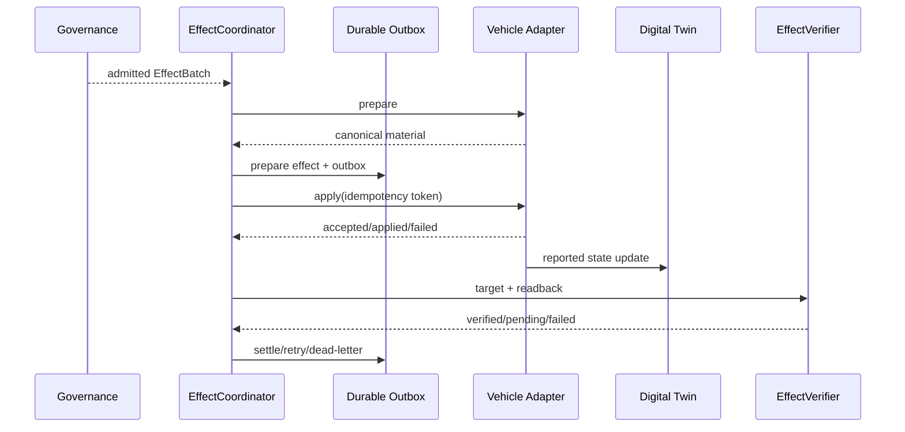

# Effect、车辆 Adapter 与 Readback 模块详设

版本：1.0
适用范围：Android 13 生产软件
上级文档：[生产软件开发文档](../CENTRAL_BRAIN_SOFTWARE_DEVELOPMENT.md)

`production_document_scope=true`
`module_detailed_design=true`
`production_ready=false`
`target_hardware_validated=false`

## 1. 设计目标与边界

本模块把治理通过的动作转换为 typed `EffectIntent`，执行依赖规划、durable prepare/outbox、Adapter dispatch、
readback 核验、重试、补偿和撤销。模型和 HMI 不允许直接引用 Adapter。

没有生产 Adapter、durable material 或 readback 时，Effect gate 必须阻止真实执行，并向 HMI 投影
unavailable/failed，而不是成功。

## 2. 需求映射

| Req ID | 本模块责任 |
| --- | --- |
| `S2-EFF-001` | typed EffectIntent 和 desired/reported 状态 |
| `S2-ADP-001` | Capability 与 Adapter/availability 绑定 |
| `S2-ADP-002` | prepare/dispatch/readback |
| `S2-ADP-003` | HVAC 18.0..30.0 摄氏度、0.5 步进 |
| `S2-ADP-004` | 座椅展开方向与安全约束 |
| `S2-SAF-003` | 高风险动作独立审批 |
| `S2-HMI-004` | 不可用时明确失败关闭 |
| `S2-HMI-007` | 真实 readback 驱动渐进 UI |

## 3. 源码地图

| 代码路径 | 关键符号 | 设计责任 |
| --- | --- | --- |
| [EffectContract.java](../../central-brain/android-runtime/central-brain-sdk/src/main/java/com/centralbrain/sdk/effect/EffectContract.java) | Effect 常量与校验 | SDK typed Effect 合同 |
| [EffectBatch.java](../../central-brain/android-runtime/runtime-service/src/main/java/com/centralbrain/runtime/effects/EffectBatch.java) | `create`、`Entry`、batch digest | 原子动作批次 |
| [EffectDependencyPlanner.java](../../central-brain/android-runtime/runtime-service/src/main/java/com/centralbrain/runtime/effects/EffectDependencyPlanner.java) | `plan`、waves | 依赖和资源冲突 |
| [AdapterRegistry.java](../../central-brain/android-runtime/runtime-service/src/main/java/com/centralbrain/runtime/effects/AdapterRegistry.java) | `Registration`、`resolve` | capability/area/profile 到 Adapter |
| [EffectAdapter.java](../../central-brain/android-runtime/runtime-service/src/main/java/com/centralbrain/runtime/effects/EffectAdapter.java) | descriptor、`apply`、`getStatus` | Adapter SPI |
| [EffectAdapterContract.java](../../central-brain/android-runtime/runtime-service/src/main/java/com/centralbrain/runtime/effects/EffectAdapterContract.java) | `requireSafe`、result matching | Adapter 安全校验 |
| [EffectDeliveryActivationGate.java](../../central-brain/android-runtime/runtime-service/src/main/java/com/centralbrain/runtime/effects/EffectDeliveryActivationGate.java) | `evaluate`、`resolveInvocation` | dispatch 总开关 |
| [EffectCoordinator.java](../../central-brain/android-runtime/runtime-service/src/main/java/com/centralbrain/runtime/effects/EffectCoordinator.java) | `execute`、`prepare`、`dispatch` | 批次协调 |
| [EffectVerifier.java](../../central-brain/android-runtime/runtime-service/src/main/java/com/centralbrain/runtime/effects/EffectVerifier.java) | `verify`、`expectedTargetDigest` | readback 核验 |
| [DigitalTwinEffectReconciler.java](../../central-brain/android-runtime/runtime-service/src/main/java/com/centralbrain/runtime/effects/DigitalTwinEffectReconciler.java) | `reconcile` | Twin 与 Effect 状态合并 |
| [CompensationPlanner.java](../../central-brain/android-runtime/runtime-service/src/main/java/com/centralbrain/runtime/effects/CompensationPlanner.java) | `plan`、`BeforeSnapshot` | 反向波次补偿 |
| [UndoService.java](../../central-brain/android-runtime/runtime-service/src/main/java/com/centralbrain/runtime/effects/UndoService.java) | `issueHandles`、`requestUndo` | 用户撤销准入 |
| [DurableEffectRepository.java](../../central-brain/android-runtime/runtime-service/src/main/java/com/centralbrain/runtime/persistence/DurableEffectRepository.java) | outbox lifecycle | durable dispatch 事实 |

## 4. 核心设计

### 4.1 Effect Batch

每个 `EffectBatch.Entry` 绑定 EffectIntent、effect ID、resource key、dependency IDs 和 required 标记。
Batch constructor 校验同 session/plan/action、ID 唯一、dependency 存在、无环和 digest 一致。

`EffectDependencyPlanner` 将可并发且 resource key 不冲突的 Effect 分到同一 wave。wave 之间按 dependency
顺序执行。

### 4.2 Adapter SPI

Adapter descriptor 声明 adapter ID、destination、idempotency mode、duplicate apply、status consistency
和 maximum operation time。调用顺序：

1. `PreparationAdapter.prepare()` 生成 canonical payload/envelope、before state 和 evidence digest。
2. Repository 原子写入 Effect 与 outbox。
3. Activation gate 验证治理、Adapter、material、apply/status 和生产授权。
4. `EffectAdapter.apply(invocation)`。
5. `EffectAdapter.getStatus(idempotencyToken)` 或车辆 readback。
6. `EffectVerifier` 生成 observation。

### 4.3 Readback

`EffectVerifier` 比较 typed target 与 `VerificationEvidence`，支持 exact、tolerance 和 state transition。
callback applied 不是最终车辆事实，除非 capability policy 明确允许该 evidence kind。HVAC、座椅等有
reported signal 的能力应优先使用 Digital Twin readback。

### 4.4 Compensation 与 Undo

补偿只可基于执行前可信 `BeforeSnapshot` 和已经核验的 source Effect。`CompensationPlanner` 反向排列 wave，
并为每个补偿生成独立 idempotency key。Undo handle 有期限、owner 和 governance snapshot；请求撤销仍需
当前安全状态准入。

## 5. 接口与数据

车辆 Adapter 最小接口语义：

```java
Descriptor descriptor();
ApplyResult apply(Invocation invocation);
StatusResult getStatus(String idempotencyToken);
```

生产实现还必须提供 capability/area mapping、canonical payload codec、before-state capture、deadline/cancel、
readback source 和稳定 failure codes。

HVAC 参数以 deci-C 表示，范围 180..300、步进 5；座椅 recline 的正向定义必须与 HMI 和 OEM Adapter 一致，
“增大 recline”表示靠背展开。

## 6. 关键流程



## 7. 失败关闭与并发

- Activation gate 任一 blocker 存在时不构造 invocation。
- 相同 idempotency token 的重复 apply 必须返回原结果或明确拒绝，不能二次执行。
- required Effect prepare 失败时整个 batch 在 dispatch 前中止。
- optional Effect 失败可形成 PARTIAL，但必须进入 HMI 和 audit。
- status unknown 不得映射为 success。
- readback stale/conflict/untrusted 时保持 pending 或 failed。
- 资源相同的 HVAC/座椅动作不得并发覆盖。
- 补偿没有可信 before state 时进入 inconclusive/stuck，不猜测反向值。

## 8. 代码校对清单

- [ ] Effect 绑定 session/plan/action/capability/area/idempotency。
- [ ] 参数通过 Capability `TargetRange`。
- [ ] 模型和 HMI 没有 Adapter ID 输入字段。
- [ ] prepare material 在 dispatch 前 durable。
- [ ] activation gate 验证治理、授权、material、apply 和 status。
- [ ] apply 与 getStatus 的 token 和 digest 一致。
- [ ] readback 来自 reported state，不使用 desired 自证。
- [ ] HVAC 采用 18.0..30.0、0.5 步进。
- [ ] 座椅正向角度表示展开，并受状态和审批约束。
- [ ] partial、retry、dead-letter、compensation 均有 typed Event。

## 9. 增量开发规则

接入真实车辆能力时先新增 OEM Adapter 模块，不修改 Model 或 HMI 绕过链路。Adapter 必须经 owner 审核后
注册到 `AdapterRegistry` 的 production profile，并更新 Capability availability、治理规则、readback 和
发布准入证据。

## 10. 当前缺口

- 真实 Vehicle Adapter、durable material source 和 production readback authority 尚未注册。
- Effect activation snapshot 当前保持 blocked。
- 购物、支付和导航服务也必须按相同 Adapter/approval/readback 语义接入。
- `production_ready=false`，`target_hardware_validated=false`。
