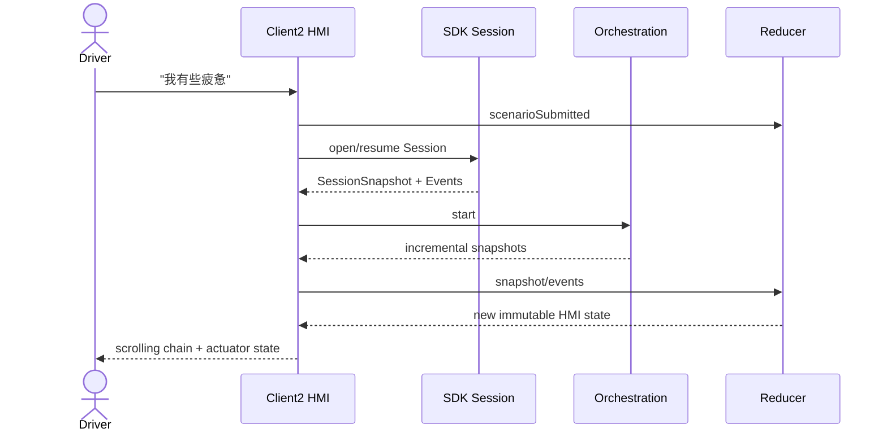

# Client2 座舱 HMI 模块详设

版本：1.0
适用范围：Android 13 生产软件
上级文档：[生产软件开发文档](../CENTRAL_BRAIN_SOFTWARE_DEVELOPMENT.md)

`production_document_scope=true`
`module_detailed_design=true`
`production_ready=false`
`target_hardware_validated=false`

## 1. 设计目标与边界

本模块在 Client2 中提供 AIOS 场景入口、模型输入/输出、实时执行链路、审批、车辆状态投影和渐进执行反馈。
第一层界面只保留自然意图任务入口与滚动链路；HVAC、座椅等手动控制属于次级面板，且必须进入与场景任务
相同的 Session、Governance、Effect 和 readback 链路。

HMI 只投影 Runtime 状态，不得凭动画或本地状态宣称车辆动作成功。

## 2. 需求映射

| Req ID | 本模块责任 |
| --- | --- |
| `APP-001` | 场景任务入口和语音转写文本 |
| `APP-002` | 文本与单帧座舱图像形成同一请求 |
| `APP-005` | 显示模型输入、缩略图和居中预览 |
| `S2-UX-001` | 第一层仅任务入口和实时链路 |
| `S2-UX-002` | 输入到结果的增量显示 |
| `S2-UX-003` | partial、retry、undo、compensation 可区分 |
| `S2-HMI-001`、`S2-HMI-002` | HVAC 与座椅的 desired/reported 投影和安全限制 |
| `S2-HMI-003`、`S2-HMI-004`、`S2-HMI-005` | 恢复状态、unavailable 和统一执行链路 |
| `S2-HMI-006`、`S2-HMI-007` | 1920x1080 半透明布局和渐进执行反馈 |
| `S2-HMI-008`、`S2-HMI-009` | 多模态输入输出、座位事实、购物与导航确认 |
| `S2-OBS-002` | 顺序滚动 Runtime/Model/Graph/Effect/Readback 里程碑 |

## 3. 源码地图

| 代码路径 | 关键符号 | 设计责任 |
| --- | --- | --- |
| [CockpitControlCoordinator.java](../../apk-labs/client2-central-brain/bridge/src/com/centralbrain/client2/CockpitControlCoordinator.java) | `install`、`onClick`、`startScenario`、`render` | Activity 注入、事件接收和 View 渲染 |
| [CockpitHmiState.java](../../apk-labs/client2-central-brain/bridge/src/com/centralbrain/client2/CockpitHmiState.java) | immutable state、`checkpoint` | HMI 单一状态树 |
| [CockpitHmiReducer.java](../../apk-labs/client2-central-brain/bridge/src/com/centralbrain/client2/CockpitHmiReducer.java) | `reduce`、typed `Event` | 唯一状态转换入口 |
| [CockpitExecutionTimeline.java](../../apk-labs/client2-central-brain/bridge/src/com/centralbrain/client2/CockpitExecutionTimeline.java) | phase/stage/trace projection | 实时执行链路 |
| [Client2ScenarioBridge.java](../../apk-labs/client2-central-brain/bridge/src/com/centralbrain/client2/Client2ScenarioBridge.java) | `openSession`、`resumeSession` | SDK Session 连接桥 |
| [OrchestrationRuntimeClient.java](../../apk-labs/client2-central-brain/bridge/src/com/centralbrain/client2/OrchestrationRuntimeClient.java) | `openOrResume`、approval response | Orchestration facade |
| [CockpitScenarioControlState.java](../../apk-labs/client2-central-brain/bridge/src/com/centralbrain/client2/CockpitScenarioControlState.java) | scenario definition/lifecycle | UI 场景到 canonical 场景映射 |
| [CockpitHvacState.java](../../apk-labs/client2-central-brain/bridge/src/com/centralbrain/client2/CockpitHvacState.java) | desired/reported/effect state | HVAC 投影 |
| [HvacControlIntent.java](../../apk-labs/client2-central-brain/bridge/src/com/centralbrain/client2/HvacControlIntent.java) | `stepTemperature`、`toWireValue` | HVAC typed UI intent |
| [CockpitSeatState.java](../../apk-labs/client2-central-brain/bridge/src/com/centralbrain/client2/CockpitSeatState.java) | safety context/decision、desired/reported | 座椅投影 |
| [SeatControlIntent.java](../../apk-labs/client2-central-brain/bridge/src/com/centralbrain/client2/SeatControlIntent.java) | `stepRecline`、`toWireValue` | 座椅 typed UI intent |
| [CockpitRecoveryState.java](../../apk-labs/client2-central-brain/bridge/src/com/centralbrain/client2/CockpitRecoveryState.java) | approval/aggregate/compensation | 恢复与撤销 UI |
| [CockpitDisplayPolicy.java](../../apk-labs/client2-central-brain/bridge/src/com/centralbrain/client2/CockpitDisplayPolicy.java) | `resolve`、panel bounds | 1920x1080 和大字模式 |
| [DrivingUxPolicy.java](../../apk-labs/client2-central-brain/bridge/src/com/centralbrain/client2/DrivingUxPolicy.java) | `modeFor` | 驾驶状态显示限制 |
| [CockpitMultimodalInput.java](../../apk-labs/client2-central-brain/bridge/src/com/centralbrain/client2/CockpitMultimodalInput.java) | `load`、`openParcelable`、`decodePreview` | 单帧图像输入 |
| [main_layout.central_brain_panel.xml](../../apk-labs/client2-central-brain/patches/main_layout.central_brain_panel.xml) | overlay、buttons、trace、preview | HMI View 结构 |
| [client2 project contract](../../apk-labs/client2-central-brain/client2-central-brain.project.json) | requirements、layout、bridge | 集成清单 |

## 4. 核心设计

### 4.1 单向状态流

所有外部事件先转换为 `CockpitHmiReducer.Event`：

```text
Button / Binder callback / lifecycle
        -> reducer event
        -> CockpitHmiState new revision
        -> CockpitControlCoordinator.render()
```

View 不保存业务真相。`CockpitControlCoordinator` 的字段只可保存 View 引用、连接对象和渲染节流状态；
Session、desired/reported、审批和执行状态必须来自 `CockpitHmiState`。

### 4.2 场景入口

主按钮的 tag 映射到 canonical scenario：

- `care.fatigue`：疲劳关怀；
- `care.cold`：温度关怀；
- `cabin.multimodal`：文本“处理一下”与座舱图像。

`startScenario()` 重置 timeline，构造输入投影，打开或恢复 Session，再通过 Orchestration 获取计划状态。
按钮不能直接调用 HVAC 或座椅方法。

### 4.3 实时链路

`CockpitExecutionTimeline` 固定阶段：

`INTENT → CONTEXT → PLAN → POLICY → GRAPH → EFFECT → READBACK`

`CockpitControlCoordinator.appendLiveTrace()` 只接受有界 stage/status/detail，并以序列顺序追加。模型输入显示
用户文字；存在图像时显示等比缩略图。模型输出显示结构化校验后的 assistant text 和候选动作摘要。

### 4.4 HVAC 与座椅

`HvacControlIntent` 以 deci-C 保存温度，`stepTemperature()` 每步 5，范围由构造校验保持 180..300。
`CockpitHvacState` 分开 desired、submitted revision、reported、evidence source/quality 和 effect state。

`SeatControlIntent` 的 `reclineDegrees` 增大表示靠背展开。`CockpitSeatState.evaluate()` 根据 driving、occupancy、
belt 和 evidence 决定 ALLOW/DENY/APPROVAL；HMI 本地判断只负责禁用控件，最终决定来自 Governance。

### 4.5 浮层与预览

主面板为 1920x1080 右侧半透明 overlay，由底部导航热区切换；点击面板外关闭。图像预览覆盖屏幕中心，
点击图外退出。`CockpitDisplayPolicy.panelFitsDisplay()` 必须在渲染前通过。

## 5. 接口与数据

`Client2ScenarioBridge` 只经 `ScenarioClient` 操作 Session，`OrchestrationRuntimeClient` 只经
`OrchestrationClient` 操作 Graph。HMI 接收：

- `SessionSnapshot`；
- `RuntimeEvent`；
- `OrchestrationSnapshot`；
- Effect/Observation typed projection；
- connection/replay/overflow/closed 错误。

HMI 发出：

- `SessionRequest`；
- `OrchestrationStartRequest`；
- `ApprovalResponse`；
- `UndoRequest`；
- typed HVAC/Seat intent，经 Session 入口提交。

## 6. 关键流程



## 7. 失败关闭与并发

- Binder callback 在主线程投递后再调用 reducer。
- Session handle 与 callback 使用 generation/connection 所有权，旧连接回调不得覆盖新状态。
- overflow 后显示恢复状态并从 Runtime cursor 重放。
- 图像加载、解码和 Parcelable 都执行字节上限与资源关闭。
- HMI 动画只能表示“请求中/执行投影”，不能把本地动画终点写成 reported success。
- vehicle evidence unavailable 时状态保持 unavailable。
- 行驶模式隐藏长文本和高风险控件。

## 8. 代码校对清单

- [ ] 所有 View 事件转换为 reducer event。
- [ ] `render()` 不产生业务状态变更。
- [ ] 场景按钮只启动 Session/Orchestration，不直接调用执行器。
- [ ] timeline 阶段按 Runtime sequence 增量显示。
- [ ] 模型输入文字与实际请求一致。
- [ ] 图像等比缩略、可放大、点击图外退出。
- [ ] HVAC desired/reported 分离，18.0..30.0、0.5 步进。
- [ ] 座椅角度增大表示展开，并显示安全决定。
- [ ] unknown/partial/retry/undo/compensation 有独立显示。
- [ ] 1920x1080 panel bounds 和触摸目标符合 policy。

## 9. 增量开发规则

新增场景入口时先更新需求和 Scenario Manifest，再增加 UI tag 到 canonical scenario 的映射、Reducer event、
timeline 文案和 accessibility label。新增车辆控件必须复用 Session/Governance/Effect/readback，不得新增
本地直连通道。

## 10. 当前缺口

- `apk-labs` 集成源仍需迁移到 OEM 可持续构建的正式 Client2 工程。
- 部分 P4-R7 渲染和交互修订尚未进入主分支生产基线。
- 真实语音、相机 authority、车辆 readback 和生产 Orchestration 后端尚未闭环。
- `production_ready=false`，`target_hardware_validated=false`。
