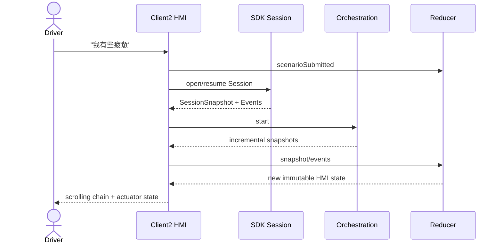
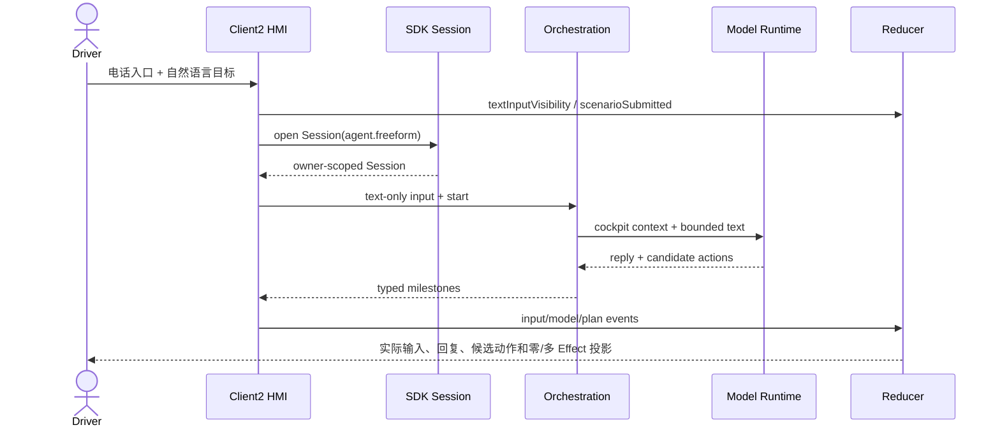
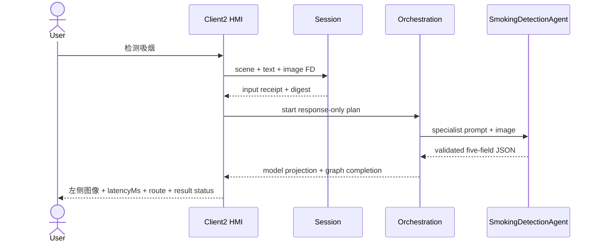

# Client2 座舱 HMI 模块详设

版本：1.1
适用范围：Android 13 生产软件
上级文档：[生产软件开发文档](../CENTRAL_BRAIN_SOFTWARE_DEVELOPMENT.md)

`production_document_scope=true`
`module_detailed_design=true`
`production_ready=false`
`target_hardware_validated=false`

## 1. 设计目标与边界

本模块在 Client2 中提供 AIOS 场景入口、模型输入/输出、实时执行链路、审批、车辆状态投影和渐进执行反馈。
第一层界面只保留自然意图任务入口与滚动链路；HVAC、座椅等手动控制属于次级面板，且必须进入与场景任务
相同的 Session、Governance、Effect 和 readback 链路。

HMI 只投影 Runtime 状态，不得凭动画或本地状态宣称车辆动作成功。

## 2. 需求映射

| Req ID | 本模块责任 |
| --- | --- |
| `APP-001` | 场景任务入口和语音转写文本 |
| `APP-002` | 文本与单帧座舱图像形成同一请求 |
| `APP-005` | 显示模型输入、左侧独立图像、模型耗时和居中预览 |
| `APP-006` | 1..1024 字符任意文本输入、Session 绑定和一次消费 |
| `APP-007` | “检测吸烟”入口与同帧图像绑定 |
| `S2-UX-001` | 第一层仅任务入口和实时链路 |
| `S2-UX-002` | 输入到结果的增量显示 |
| `S2-UX-003` | partial、retry、undo、compensation 可区分 |
| `S2-HMI-001`、`S2-HMI-002` | HVAC 与座椅的 desired/reported 投影和安全限制 |
| `S2-HMI-003`、`S2-HMI-004`、`S2-HMI-005` | 恢复状态、unavailable 和统一执行链路 |
| `S2-HMI-006`、`S2-HMI-007` | 1920x1080 半透明布局和渐进执行反馈 |
| `S2-HMI-008`、`S2-HMI-009` | 多模态输入输出、座位事实、购物与导航确认 |
| `S2-HMI-010` | 导航/电话双入口、互斥浮层和外部点击关闭 |
| `S2-HMI-011` | 显示 Agent 路由、图文输入、五字段输出和合规状态 |
| `S2-HMI-012` | 200 张受控评测帧、逐次随机选图和标签隔离 |
| `S2-HMI-013` | 图片脱离右侧对话框并在左侧独立显示真实模型耗时 |
| `S2-HMI-014` | 分层座椅图示和靠背展开动画 |
| `S2-OBS-002` | 顺序滚动 Runtime/Model/Graph/Effect/Readback 里程碑 |

## 3. 源码地图

| 代码路径 | 关键符号 | 设计责任 |
| --- | --- | --- |
| [CockpitControlCoordinator.java](../../apk-labs/client2-central-brain/bridge/src/com/centralbrain/client2/CockpitControlCoordinator.java) | `install`、`onClick`、`startScenario`、`render` | Activity 注入、事件接收和 View 渲染 |
| [CockpitHmiState.java](../../apk-labs/client2-central-brain/bridge/src/com/centralbrain/client2/CockpitHmiState.java) | immutable state、`checkpoint` | HMI 单一状态树 |
| [CockpitHmiReducer.java](../../apk-labs/client2-central-brain/bridge/src/com/centralbrain/client2/CockpitHmiReducer.java) | `reduce`、typed `Event` | 唯一状态转换入口 |
| [CockpitExecutionTimeline.java](../../apk-labs/client2-central-brain/bridge/src/com/centralbrain/client2/CockpitExecutionTimeline.java) | phase/stage/trace projection | 实时执行链路 |
| [Client2ScenarioBridge.java](../../apk-labs/client2-central-brain/bridge/src/com/centralbrain/client2/Client2ScenarioBridge.java) | `openSession`、`resumeSession` | SDK Session 连接桥 |
| [OrchestrationRuntimeClient.java](../../apk-labs/client2-central-brain/bridge/src/com/centralbrain/client2/OrchestrationRuntimeClient.java) | `openOrResume`、approval response | Orchestration facade |
| [CockpitScenarioControlState.java](../../apk-labs/client2-central-brain/bridge/src/com/centralbrain/client2/CockpitScenarioControlState.java) | scenario definition/lifecycle | UI 场景到 canonical 场景映射 |
| [CockpitHvacState.java](../../apk-labs/client2-central-brain/bridge/src/com/centralbrain/client2/CockpitHvacState.java) | desired/reported/effect state | HVAC 投影 |
| [HvacControlIntent.java](../../apk-labs/client2-central-brain/bridge/src/com/centralbrain/client2/HvacControlIntent.java) | `stepTemperature`、`toWireValue` | HVAC typed UI intent |
| [CockpitSeatState.java](../../apk-labs/client2-central-brain/bridge/src/com/centralbrain/client2/CockpitSeatState.java) | safety context/decision、desired/reported | 座椅投影 |
| [SeatControlIntent.java](../../apk-labs/client2-central-brain/bridge/src/com/centralbrain/client2/SeatControlIntent.java) | `stepRecline`、`toWireValue` | 座椅 typed UI intent |
| [CockpitRecoveryState.java](../../apk-labs/client2-central-brain/bridge/src/com/centralbrain/client2/CockpitRecoveryState.java) | approval/aggregate/compensation | 恢复与撤销 UI |
| [CockpitDisplayPolicy.java](../../apk-labs/client2-central-brain/bridge/src/com/centralbrain/client2/CockpitDisplayPolicy.java) | `resolve`、panel bounds | 1920x1080 和大字模式 |
| [DrivingUxPolicy.java](../../apk-labs/client2-central-brain/bridge/src/com/centralbrain/client2/DrivingUxPolicy.java) | `modeFor` | 驾驶状态显示限制 |
| [CockpitMultimodalInput.java](../../apk-labs/client2-central-brain/bridge/src/com/centralbrain/client2/CockpitMultimodalInput.java) | `load`、`selectSmokingOrdinal`、`openParcelable`、`decodePreview` | 固定座舱帧、随机评测帧和单帧图文输入 |
| [CockpitModelPrompt.java](../../central-brain/android-runtime/runtime-service/src/main/java/com/centralbrain/runtime/model/CockpitModelPrompt.java) | `forFreeform`、`validateActions` | 任意文本座舱上下文与动作白名单 |
| [freeform manifest](../../central-brain/android-runtime/runtime-service/src/main/assets/scenarios/scene.aios.freeform.v1.json) | `scene.aios.freeform.v1` | 任意文本 response-only 场景图 |
| [smoking manifest](../../central-brain/android-runtime/runtime-service/src/main/assets/scenarios/scene.cabin.compliance.smoking.v1.json) | `scene.cabin.compliance.smoking.v1` | 吸烟检测 response-only 场景图 |
| [SmokingDetectionResult.java](../../central-brain/android-runtime/runtime-service/src/main/java/com/centralbrain/runtime/model/SmokingDetectionResult.java) | 五字段检测输出 | HMI 接收内容的上游校验边界 |
| [main_layout.central_brain_panel.xml](../../apk-labs/client2-central-brain/patches/main_layout.central_brain_panel.xml) | overlay、buttons、trace、preview | HMI View 结构 |
| [prepare_workspace.sh](../../apk-labs/client2-central-brain/scripts/prepare_workspace.sh) | `copy_smoking_dataset` | 将 100+100 张受控帧打入调试 APK 的 `res/raw` |
| [central_brain_seat_back.xml](../../apk-labs/client2-central-brain/patches/res/drawable/central_brain_seat_back.xml) | headrest/back/bolster/lumbar paths | 可旋转座椅靠背矢量层 |
| [central_brain_seat_base.xml](../../apk-labs/client2-central-brain/patches/res/drawable/central_brain_seat_base.xml) | cushion/side bolster/lower shell paths | 静态座椅坐垫矢量层 |
| [central_brain_seat_rail.xml](../../apk-labs/client2-central-brain/patches/res/drawable/central_brain_seat_rail.xml) | rails/brackets | 座椅滑轨矢量层 |
| [client2 project contract](../../apk-labs/client2-central-brain/client2-central-brain.project.json) | requirements、layout、bridge | 集成清单 |

## 4. 核心设计

### 4.1 单向状态流

所有外部事件先转换为 `CockpitHmiReducer.Event`：

```text
Button / Binder callback / lifecycle
        -> reducer event
        -> CockpitHmiState new revision
        -> CockpitControlCoordinator.render()
```

View 不保存业务真相。`CockpitControlCoordinator` 的字段只可保存 View 引用、连接对象和渲染节流状态；
Session、desired/reported、审批和执行状态必须来自 `CockpitHmiState`。

### 4.2 双入口与场景映射

底部导航热区使用 `central_brain_menu_toggle`，只切换固定任务面板；底部电话热区使用
`central_brain_freeform_toggle`，只切换任意文本输入框。`CockpitHmiState.TextInputVisibility` 与
任务面板可见状态互斥，所有显隐变化必须经 `CockpitHmiReducer`。输入卡提供独立关闭控件并支持浮层外
点击关闭；输入框提交前执行 trim、空值拒绝和 1024 字符上限校验。

主按钮的 tag 映射到 canonical scenario：

- `care.fatigue`：疲劳关怀；
- `care.cold`：温度关怀；
- `cabin.multimodal`：文本“处理一下”与座舱图像。
- `cabin.smoking`：文本“检测吸烟”、座舱图像与 `scene.cabin.compliance.smoking.v1`。
- `agent.freeform`：任意文本与 `scene.aios.freeform.v1`。

`startScenario()` 重置 timeline，构造输入投影，打开或恢复 Session，再通过 Orchestration 获取计划状态。
按钮不能直接调用 HVAC 或座椅方法。

任意文本只在 `pendingFreeformInput` 中保留到 Session 打开并完成输入接收，随后立即清空。原文不得进入
HMI checkpoint、SharedPreferences、Event、审计或错误消息；界面显示仅限当前运行。

### 4.3 实时链路

`CockpitExecutionTimeline` 固定阶段：

`INTENT → CONTEXT → PLAN → POLICY → GRAPH → EFFECT → READBACK`

`CockpitControlCoordinator.appendLiveTrace()` 只接受有界 stage/status/detail，并以序列顺序追加。模型输入文字
保留在右侧链路；图像不得成为链路内部子 View，而由 `centralBrainModelInputImageOverlay` 在桌面左侧独立显示。
`renderModelLatency()` 只读取 `CockpitSimulatedScenarioState.getModelLatencyMs()`，在模型完成后把真实投影值写到
图像下方；开始、失败或缺失投影分别显示 `-- ms`、失败或 `UNAVAILABLE`，禁止由 HMI 自行计时冒充 Provider
耗时。模型输出显示结构化校验后的 assistant text 和候选动作摘要。

### 4.4 HVAC 与座椅

`HvacControlIntent` 以 deci-C 保存温度，`stepTemperature()` 每步 5，范围由构造校验保持 180..300。
`CockpitHvacState` 分开 desired、submitted revision、reported、evidence source/quality 和 effect state。

`SeatControlIntent` 的 `reclineDegrees` 增大表示靠背展开。`CockpitSeatState.evaluate()` 根据 driving、occupancy、
belt 和 evidence 决定 ALLOW/DENY/APPROVAL；HMI 本地判断只负责禁用控件，最终决定来自 Governance。

座椅执行图由四个独立视觉层组成：滑轨、坐垫/侧翼、靠背/头枕、转轴。只有
`centralBrainSeatBack` 围绕底部转轴旋转，`animateSeat(15, 30)` 将角度增量映射为负向屏幕旋转，使靠背顶部
远离坐垫；坐垫和滑轨保持稳定。角度文字与动画使用同一个 `ValueAnimator` 值，但动画完成仍只表示
界面仿真状态，不能写入 `reported`。

### 4.5 浮层与预览

主面板为 1920x1080 右侧半透明 overlay，由底部导航热区切换；点击面板外关闭。多模态输入使用左侧
`520x356dp` 独立浮层，其中图像固定为 `496x279dp`、`FIT_CENTER`，耗时栏固定在图像下方。购物/路线反馈
出现时从 `248dp` 下移到 `500dp`，不得遮挡图像或耗时。点击图像打开屏幕中心预览，点击图外退出。
`CockpitDisplayPolicy.panelFitsDisplay()` 必须在渲染前通过。

### 4.6 厂商渲染与输入隔离

Client2 补丁必须保留原版 `view1/view2/view3` 容器和 `topControls` 属性。AIOS 只追加默认隐藏的
Android overlay，不得给 `TuanjieView` 设置触摸监听、调用 `setRenderScale`、反射访问
RenderService 或发送 Unity GameObject 消息。浮层隐藏时，车模区域的触摸全部由厂商输入链处理。

AIOS HVAC/Seat 动画是明确标注的 UI 仿真，不覆盖 Unity 原生温度，不写入共享 RenderService，
也不作为 Effect/readback 成功证据。详见
[RenderService 厂商渲染基线模块](14-renderservice-unity.md)。

### 4.7 吸烟检测投影

`CockpitMultimodalInput` 用场景白名单选择图像源、触发文字、MIME、文件名、字节数和 SHA-256，不能由任意
UI tag 拼接资源名。`cabin.multimodal` 继续使用固定 PNG；`cabin.smoking` 的调试输入从 200 个已签名 APK
资源中以 `Random.nextInt(200)` 逐次选择，前 100 个映射到正例资源、后 100 个映射到反例资源。传给模型的
文件名统一为 `cabin-evaluation-frame-NNN.jpg`，不得包含 `positive`、`negative` 或 `smoking` 标签。每次只
读取、哈希和解码命中的一张图，不得把 200 张同时载入内存。生产构建必须用相同的 typed input 合同接入
相机 authority，并排除调试数据集。

“检测吸烟”触发后，链路依次显示 `MODEL INPUT`、`AGENT ROUTER`、`MODEL OUTPUT` 和
`COMPLIANCE RESULT`。最终状态只取 `DETECTED`、`NOT_DETECTED` 或 `UNCERTAIN`，详细内容显示经过 Runtime
校验的五字段紧凑 JSON。

该场景不显示执行器浮层，不合成车身动作，也不把检测阳性解释为业务处置完成。完整图像仍沿用受驾驶状态
限制的居中预览规则。

## 5. 接口与数据

`Client2ScenarioBridge` 只经 `ScenarioClient` 操作 Session，`OrchestrationRuntimeClient` 只经
`OrchestrationClient` 操作 Graph。HMI 接收：

- `SessionSnapshot`；
- `RuntimeEvent`；
- `OrchestrationSnapshot`；
- Effect/Observation typed projection；
- connection/replay/overflow/closed 错误。

HMI 发出：

- `SessionRequest`；
- `OrchestrationStartRequest`；
- `ApprovalResponse`；
- `UndoRequest`；
- typed HVAC/Seat intent，经 Session 入口提交。
- owner-scoped、Session-bound、一次消费的文字或文字/单图输入。

## 6. 关键流程



任意文本流程：



吸烟检测流程：



## 7. 失败关闭与并发

- Binder callback 在主线程投递后再调用 reducer。
- Session handle 与 callback 使用 generation/connection 所有权，旧连接回调不得覆盖新状态。
- overflow 后显示恢复状态并从 Runtime cursor 重放。
- 图像加载、解码和 Parcelable 都执行字节上限与资源关闭。
- 评测资源的类别只用于 APK 内部资源映射，不得进入模型可见文件名、请求文字或输出。
- 任意文本在 Session 接收后清空进程内暂存，不能进入 checkpoint 或日志。
- 模型候选动作没有直接执行权；缺少 typed Plan 时 Effect 记录必须为零。
- HMI 动画只能表示“请求中/执行投影”，不能把本地动画终点写成 reported success。
- vehicle evidence unavailable 时状态保持 unavailable。
- 行驶模式隐藏长文本和高风险控件。

## 8. 代码校对清单

- [ ] 所有 View 事件转换为 reducer event。
- [ ] `render()` 不产生业务状态变更。
- [ ] 场景按钮只启动 Session/Orchestration，不直接调用执行器。
- [ ] timeline 阶段按 Runtime sequence 增量显示。
- [ ] 模型输入文字与实际请求一致。
- [ ] 图像只在左侧独立浮层等比显示，不嵌入右侧对话框，可放大并通过点击图外退出。
- [ ] 图像下方耗时来自模型投影 `latencyMs`，缺失时显示 unavailable。
- [ ] 导航入口只切换固定任务面板，电话入口只切换任意文本输入。
- [ ] 两个入口互斥，输入卡可通过关闭控件或浮层外点击关闭。
- [ ] 输入 1..1024 字符且原文不持久化。
- [ ] 任意文本回复和候选动作来自 Model/Runtime 事件，不由 HMI 合成。
- [ ] “检测吸烟”绑定专用场景，从 100+100 个 APK 资源中逐次随机选图，且不泄漏类别标签。
- [ ] 合规状态来自五字段投影，且不显示 Tool/Effect 成功。
- [ ] HVAC desired/reported 分离，18.0..30.0、0.5 步进。
- [ ] 座椅包含头枕、靠背、侧翼、坐垫、转轴和滑轨，角度增大表示展开，并显示安全决定。
- [ ] unknown/partial/retry/undo/compensation 有独立显示。
- [ ] 1920x1080 panel bounds 和触摸目标符合 policy。
- [ ] 原版渲染容器和右上 `topControls` 属性保持不变。
- [ ] Coordinator 无 `setRenderScale`、TuanjieView listener、RenderService 反射和 Unity message。
- [ ] AIOS 面板关闭后车门、车模和底部原生控件不受覆盖层拦截。

## 9. 增量开发规则

新增场景入口时先更新需求和 Scenario Manifest，再增加 UI tag 到 canonical scenario 的映射、Reducer event、
timeline 文案和 accessibility label。新增车辆控件必须复用 Session/Governance/Effect/readback，不得新增
本地直连通道。

## 10. 当前缺口

- `apk-labs` 集成源仍需迁移到 OEM 可持续构建的正式 Client2 工程。
- P4-R7 的侵入式 RenderScale/Unity 资源修改已撤回；生产物理触摸旋转仍待验收。
- 真实语音、相机 authority、车辆 readback 和生产 Orchestration 后端尚未闭环。
- 任意文本到动态 typed Plan、Tool 参数和 EffectIntent 的生产编译链尚未闭环。
- `production_ready=false`，`target_hardware_validated=false`。
