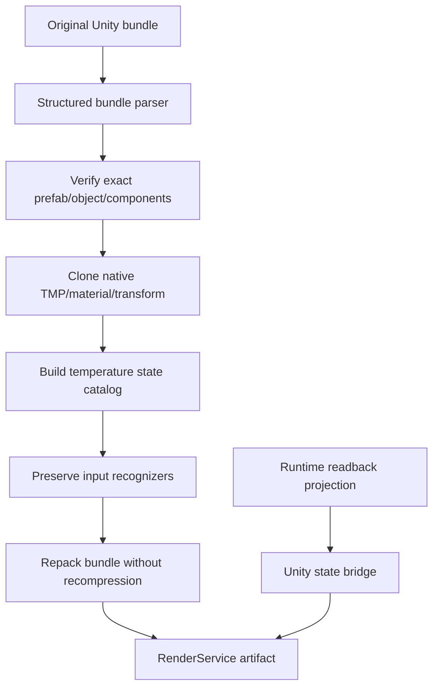

# RenderService Unity 原生界面模块详设

版本：1.0
适用范围：Android 13 生产软件
上级文档：[生产软件开发文档](../CENTRAL_BRAIN_SOFTWARE_DEVELOPMENT.md)

`production_document_scope=true`
`module_detailed_design=true`
`production_ready=false`
`target_hardware_validated=false`

## 1. 设计目标与边界

本模块负责修改 RenderService 的 Unity/Tuanjie 资源，使 HVAC 温度和车模交互保持原生渲染一致性。
Client2 不能在 Unity 表面上叠加字体冒充原生状态；温度、材质、字体和触摸识别应由 Unity 资源自身呈现。

本模块不替换引擎二进制，不修改 Android 系统镜像，也不执行真实车辆 HVAC/座椅动作。

## 2. 需求映射

| Req ID | 本模块责任 |
| --- | --- |
| `S2-HMI-001` | HVAC 原生状态投影 |
| `S2-HMI-004` | 不伪造车辆成功状态 |
| `S2-HMI-006` | 1920x1080 原生渲染布局 |
| `S2-HMI-007` | 温度和座椅反馈渐进变化 |
| `S2-ADP-003` | 18.0..30.0、0.5 摄氏度步进 |
| `S2-ADP-004` | 座椅展开方向一致 |

## 3. 源码地图

| 代码路径 | 关键符号 | 设计责任 |
| --- | --- | --- |
| [patch_unity_hvac_bundle.py](../../apk-labs/renderservice-central-brain/scripts/patch_unity_hvac_bundle.py) | `BundleContext`、`create_warm_state`、`patch_bundle` | Unity bundle 结构化修改 |
| [build_unaligned_apk.py](../../apk-labs/renderservice-central-brain/scripts/build_unaligned_apk.py) | archive rebuild | APK 资源归档重建 |
| [verify_project.sh](../../apk-labs/renderservice-central-brain/scripts/verify_project.sh) | contract verification | 资源对象、状态和构建约束检查 |
| [project contract](../../apk-labs/renderservice-central-brain/renderservice-central-brain.project.json) | asset、state、non-goals | 资源合同 |
| [README.md](../../apk-labs/renderservice-central-brain/README.md) | bundle/object assumptions | 集成说明 |

## 4. 核心设计

### 4.1 Bundle 定位

`BundleContext` 装载目标 asset bundle，建立 path ID 到 Unity object tree 的索引。
`find_game_object()` 通过稳定 GameObject name 查找对象；`components()` 按 class/type 识别 Transform、
TextMeshPro 和 Button 组件。任一唯一性假设不成立时构建失败，不能选择第一个近似对象继续。

### 4.2 温度状态

主分支当前实现以 `Degrees` TextMeshPro 为模板，为 driver/passenger 创建温度状态，并通过
`UnityEngine.UI.Button` persistent call 切换 active object。该实现仅包含 26.5 和 28.0 两个状态，
尚不满足 18.0..30.0、0.5 步进和连续原生反馈要求。

合格实现应：

1. 复用原始 TextMeshPro font、material、size、alignment 和 transform。
2. 为 25 个温度值建立稳定对象或使用原生脚本数据绑定。
3. driver/passenger 使用独立状态容器。
4. 当前值变更只显示一个文本对象。
5. 状态切换由受控 IPC/Unity bridge 驱动，不依赖屏幕坐标猜测。

### 4.3 车模交互

原生 pan/orbit recognizer 必须保留在 prefab 中，并继续接收 Unity render surface 的触摸流。资源修改不得：

- 覆盖输入 recognizer 对象；
- 在全屏创建可拦截触摸的透明对象；
- 改变 camera/orbit script 引用；
- 降低 render target 或 texture import 分辨率。

Client2 overlay 只在面板范围消费事件；其他区域事件应到达 Unity surface。

### 4.4 图像质量

构建必须保持原始 texture、mesh、shader、material、render scale 和 compression 元数据。APK 归档重建不能
二次压缩 Unity bundle。若源资源不支持目标分辨率，应报告资源缺口，而不是放大低分辨率纹理。

## 5. 接口与数据

当前模块输出是修改后的 Unity asset bundle 和集成 APK。未来正式接口应定义：

```text
setHvacTemperature(zone, deciC, revision)
setSeatRecline(zone, degrees, revision)
setEffectState(effectId, state, evidenceDigest)
```

调用必须来自 Runtime/Adapter readback projection。Unity 层只负责显示，不授予动作权限，也不把按钮动画
作为 Effect 成功证据。

## 6. 关键流程



## 7. 失败关闭与并发

- bundle/object/component 不唯一时构建终止。
- 修改后必须重新解析 bundle，验证所有 PPtr 和 path ID 可解析。
- 温度值不在 180..300 或不满足步进 5 时拒绝。
- stale revision 不覆盖新显示状态。
- Unity 主线程之外不得修改 GameObject。
- overlay 触摸范围外不得消费 pan/orbit 事件。
- 无 readback 时显示 unavailable，不自动跳到目标温度。

## 8. 代码校对清单

- [ ] 定位基于稳定对象和组件类型，不依赖模糊匹配。
- [ ] TextMeshPro font/material/size/alignment 与原生一致。
- [ ] driver/passenger 状态独立。
- [ ] 18.0..30.0 共 25 个半度状态可表达。
- [ ] 每个 zone 同时只有一个温度对象 active。
- [ ] pan/orbit recognizer、camera 和脚本引用保持。
- [ ] bundle 未被二次压缩，texture/material 元数据不变。
- [ ] Unity 显示由 Runtime projection 驱动，不自证 Effect 成功。
- [ ] 资源输出有 hash 和可重复构建清单。

## 9. 增量开发规则

优先在 OEM Unity 工程中实现 typed bridge 和原生 prefab 绑定。若只能交付资源增量，必须保持 parser 驱动、
对象唯一性检查、构建后重解析和 artifact digest。不得修改引擎二进制绕过正式接口。

## 10. 当前缺口

- 主分支只实现 26.5/28.0 两个温度状态，不满足完整温度范围。
- typed Client2/Runtime 到 Unity 状态桥尚未形成生产合同。
- P4-R7 的温度与输入修订尚未进入主分支生产基线。
- 车模清晰度、旋转和 RenderService 生命周期缺少目标硬件验收。
- `production_ready=false`，`target_hardware_validated=false`。
