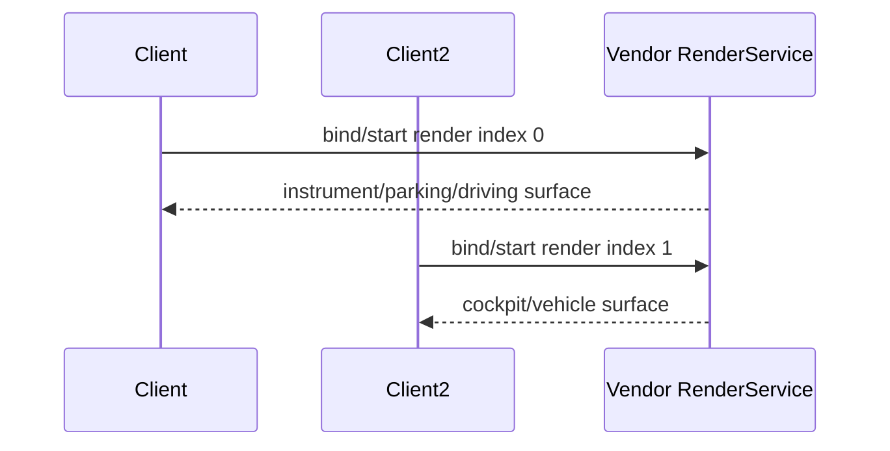
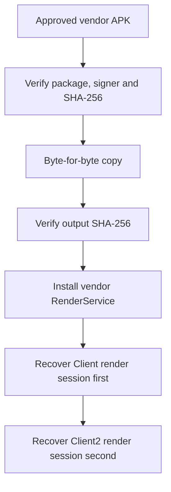

# RenderService 厂商渲染基线模块详设

版本：2.0
适用范围：Android 13 生产软件
上级文档：[生产软件开发文档](../CENTRAL_BRAIN_SOFTWARE_DEVELOPMENT.md)

`production_document_scope=true`
`module_detailed_design=true`
`production_ready=false`
`target_hardware_validated=false`

## 1. 设计目标与边界

本模块保护 Client、Client2 与 RenderService 的原始共享渲染架构。活动交付必须使用批准的
RenderService 原版 APK，不改写 Unity Addressables、TextMeshPro、材质、输入 recognizer、
RenderScale、引擎二进制或 APK 签名。

AIOS HMI 位于 Client2 Android overlay 和 Central Brain Runtime 中。没有 OEM Unity 源码、稳定
typed bridge 和真实 readback 时，AIOS 不得通过 APK 资源重写实现原生 HVAC 或座椅状态。

## 2. 需求映射

| Req ID | 本模块责任 |
| --- | --- |
| `APP-001`、`APP-004` | 保持 Client 仪表与 Client2 座舱原始页面可用 |
| `S2-HMI-001`、`S2-HMI-004` | AIOS 仿真反馈不冒充 Unity 或车辆 readback |
| `S2-HMI-006` | 保持厂商原始画布尺寸、比例和渲染参数 |
| `S2-UX-002` | 保持车模触摸、车门按钮和原始页面交互 |
| `DEL-004` | 对 APK 基线、签名和外部 OEM 依赖给出明确边界 |
| `P4-R11` | 三 APK 原始架构恢复与防回归 |

## 3. 源码地图

| 代码路径 | 关键符号 | 设计责任 |
| --- | --- | --- |
| [build_debug_apk.sh](../../apk-labs/renderservice-central-brain/scripts/build_debug_apk.sh) | `EXPECTED_SHA256`、passthrough output | 校验并复制批准的厂商 APK |
| [verify_project.sh](../../apk-labs/renderservice-central-brain/scripts/verify_project.sh) | active-build forbidden patterns | 禁止重写、重签和错误包名 |
| [project contract](../../apk-labs/renderservice-central-brain/renderservice-central-brain.project.json) | `vendor_baseline_passthrough` | 机器可读交付约束 |
| [Client2 coordinator](../../apk-labs/client2-central-brain/bridge/src/com/centralbrain/client2/CockpitControlCoordinator.java) | overlay lifecycle | 证明 AIOS 不进入 TuanjieView/RenderService |
| [Client2 layout](../../apk-labs/client2-central-brain/patches/main_layout.central_brain_panel.xml) | original render subtree、hidden overlays | 保留原始渲染树并追加默认隐藏浮层 |
| [cross-module gate](../../tools/check_central_brain_unity_native_hvac_seat.sh) | forbidden Unity overrides | Client2/RenderService 联合防回归 |

历史 `patch_unity_hvac_bundle.py` 与 `build_unaligned_apk.py` 仅保留审计价值，不被任何活动构建、
安装或发布脚本调用。

## 4. 核心设计

### 4.1 不可变 APK 基线

批准输入：

```text
package = com.tuanjie.renderservice
source = apks/original/service_20260306_171242.apk
sha256 = a24fbb471399e152c172455afbaee92e311f24f63910b263a577d58d59d7c633
delivery_mode = vendor_baseline_passthrough
```

构建脚本先计算输入 SHA-256，再复制到交付目录，最后重新计算输出 SHA-256。输入或输出任一
不一致立即失败。脚本只执行 APK 签名验证，不调用 `apksigner sign`、`zipalign`、UnityPy 或归档重建。

### 4.2 双客户端共享会话



RenderService 被安装或进程重启后，部署方必须先恢复 Client1，再恢复 Client2。Android display ID
和 RenderService index 是不同编号空间，不得相互替代。单显示设备只能顺序验证两个 Activity，
不能据此宣称双屏同时验收。

### 4.3 Client2 输入保护

`CockpitControlCoordinator` 禁止：

- 调用 `setRenderScale` 或改变 TuanjieView Surface 尺寸；
- 给 TuanjieView 安装 `OnTouchListener`；
- 反射读取 RenderService 私有字段；
- 调用 `c2sSendMessage` 修改 Unity GameObject；
- 依赖 `CentralBrainDriverTemperature` 等自建 Unity 对象。

AIOS 面板、文字输入和图片预览默认 `GONE`。面板可见时只消费自身范围和外部关闭事件；面板关闭
后车模区域必须由厂商 TuanjieView 接收。底部电话和导航透明热区必须保持有界，不得覆盖车模区域。

### 4.4 HVAC 与座椅接口

当前 AIOS 动画属于明确标注的界面仿真反馈，不写入 Unity，也不作为车辆执行证据。正式实现预留：

```text
setHvacTemperature(zone, deciC, commandRevision)
observeHvacTemperature(zone) -> value, quality, timestamp, source
setSeatRecline(zone, degrees, commandRevision)
observeSeatRecline(zone) -> value, quality, timestamp, source
```

这些接口必须由 OEM 源码工程或 Vehicle Adapter 实现。只有 typed readback 能更新 reported state。

## 5. 接口与数据

活动构建：

```bash
source env.sh
apk-labs/renderservice-central-brain/scripts/build_debug_apk.sh
```

输出：

```text
builds/renderservice-central-brain/vendor-baseline/renderservice-vendor-baseline.apk
```

输出必须与批准输入字节相同。Client2 由独立构建生成，Runtime 通过 Binder 与 Client2 通信；
RenderService 不依赖 Central Brain SDK，也不授予模型、Tool 或 Effect 权限。

## 6. 关键流程



## 7. 失败关闭与并发

- 基线文件缺失、哈希不符、包名不符或签名无效时停止交付。
- 活动构建出现 Unity patcher、重签、zipalign 或归档重写时门禁失败。
- Client2 出现 RenderScale、TuanjieView listener、RenderService 反射或 Unity 消息时门禁失败。
- 物理触摸设备不存在时，只能报告输入源阻塞，不能用合成滑动代替生产触摸验收。
- 只有单 Android display 时，只能分别验证 Client/Client2，不能声明双屏会话完成。

## 8. 代码校对清单

- [ ] 原版 APK SHA-256 与项目合同一致。
- [ ] 输出 APK 与输入 APK 字节一致并保留厂商签名。
- [ ] 活动脚本不调用历史 Unity patcher。
- [ ] Client2 原始 `view1/view2/view3` 和 `topControls` 层级、属性保持。
- [ ] AIOS overlay 默认隐藏且不改变 TuanjieView 尺寸。
- [ ] Coordinator 无 TuanjieView listener、RenderScale 和 Unity message。
- [ ] Client 仪表/泊车/行车页面可单独启动并形成 Surface。
- [ ] Client2 车门按钮和其他原始点击可用。
- [ ] 车模旋转在带真实触摸 event 的生产硬件上人工复验。
- [ ] 无车辆 readback 时 AIOS 只显示仿真反馈。

## 9. 增量开发规则

新增 Unity/HVAC/Seat 能力必须先取得 OEM 源码工程、版本化 typed bridge、调用权限和 readback
合同，再建立独立适配模块。不得重新启用 APK 资源重写作为生产实现，也不得把 Android overlay
动画迁入厂商渲染包。任何 RenderService 基线升级都必须更新批准哈希并重新执行 Client/Client2
双路会话和物理触摸回归。

## 10. 当前缺口

- OEM Unity 源码级 typed HVAC/Seat bridge 未提供，原生动态温度需求保持接口挂起。
- 生产硬件真实手指车模旋转证据待补。
- 双屏同时显示需要目标硬件提供独立 Android display；不能由应用虚构。
- `production_ready=false`，`target_hardware_validated=false`。
