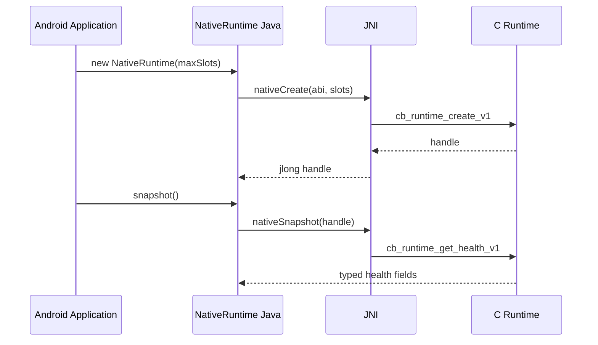

# Native Runtime 与 Vendor NPU 扩展模块详设

版本：1.0
适用范围：Android 13 生产软件
上级文档：[生产软件开发文档](../CENTRAL_BRAIN_SOFTWARE_DEVELOPMENT.md)

`production_document_scope=true`
`module_detailed_design=true`
`production_ready=false`
`target_hardware_validated=false`

## 1. 设计目标与边界

本模块提供稳定 C ABI、JNI bridge 和进程级 Native handle，预留 Vendor NPU Provider 的资源槽位和健康状态。
Java 仍是生命周期、策略、调度和错误投影所有者；C 层不实现业务场景、Governance 或车辆动作。

当前 C 实现只管理软件资源槽位，`vendor_npu_provider_available=0`、`hardware_accessed=0`。

## 2. 需求映射

| Req ID | 本模块责任 |
| --- | --- |
| `S2-MDL-001` | 为 Provider 提供稳定生命周期和资源入口 |
| `S2-MDL-002` | 暴露硬件可用性供 Scheduler/Router 使用 |
| `S2-MDL-005` | Native 不可用时失败关闭 |
| `S2-OBS-001` | 健康状态只返回计数和错误码 |
| `S2-REL-001` | ABI version、struct size 和兼容升级 |

## 3. 源码地图

| 代码路径 | 关键符号 | 设计责任 |
| --- | --- | --- |
| [central_brain_native.h](../../central-brain/android-runtime/native-runtime/src/main/cpp/include/central_brain_native.h) | ABI v1 structs/functions | 稳定 C 头文件 |
| [central_brain_native.c](../../central-brain/android-runtime/native-runtime/src/main/cpp/central_brain_native.c) | create/health/acquire/release/destroy | handle 和 slot 生命周期 |
| [central_brain_jni.c](../../central-brain/android-runtime/native-runtime/src/main/cpp/central_brain_jni.c) | `JNI_OnLoad`、native method table | JNI 映射 |
| [CMakeLists.txt](../../central-brain/android-runtime/native-runtime/src/main/cpp/CMakeLists.txt) | shared library build | NDK 产物 |
| [NativeRuntime.java](../../central-brain/android-runtime/native-runtime/src/main/java/com/centralbrain/nativebridge/NativeRuntime.java) | constructor、`snapshot`、`acquireSlot`、`close` | Java handle owner |
| [NativeRuntimeSnapshot.java](../../central-brain/android-runtime/native-runtime/src/main/java/com/centralbrain/nativebridge/NativeRuntimeSnapshot.java) | `fromNative` | typed health projection |
| [NativeRuntimeStatus.java](../../central-brain/android-runtime/native-runtime/src/main/java/com/centralbrain/nativebridge/NativeRuntimeStatus.java) | status names | C/Java 错误映射 |
| [NativeRuntimeProcess.java](../../central-brain/android-runtime/runtime-service/src/main/java/com/centralbrain/runtime/nativebridge/NativeRuntimeProcess.java) | `start`、`snapshot`、`close` | Android 进程所有权 |
| [NativeRuntimeProcessSnapshot.java](../../central-brain/android-runtime/runtime-service/src/main/java/com/centralbrain/runtime/nativebridge/NativeRuntimeProcessSnapshot.java) | ready/unavailable/closed | Runtime 诊断投影 |

## 4. 核心设计

### 4.1 ABI

ABI version 为 1。所有输入/输出 struct 首字段是 `struct_size` 和 `abi_version`，调用方必须初始化；C 实现先
校验 size/version，再读取其余字段。新增字段只能尾部扩展，并保留旧 size 处理。

对外函数：

```c
cb_runtime_create_v1
cb_runtime_get_health_v1
cb_runtime_acquire_slot_v1
cb_runtime_release_slot_v1
cb_runtime_destroy_v1
cb_status_name
```

### 4.2 Handle 与 Slot

`cb_runtime_create_v1` 校验 max slots 为 1..64，分配 runtime、mutex 和 lease array。`acquire_slot` 在锁内
生成非零且不重复 lease ID；容量满返回 `CB_STATUS_CAPACITY_EXHAUSTED`。`release_slot` 只释放存在的 lease。

`destroy` 要求调用方与其他操作串行；Java `NativeRuntime` 通过 `synchronized` 实现同 handle 串行化。

### 4.3 JNI

JNI 使用 `RegisterNatives` 固定 Java 方法到 C 函数，不依赖导出长符号名。native handle 在 `jlong` 与指针
之间转换；snapshot 以固定 long array 返回，再由 `NativeRuntimeSnapshot.fromNative()` 校验长度和字段。

### 4.4 进程所有权

`CentralBrainRuntimeApplication.onCreate()` 调用 `NativeRuntimeProcess.start()`。Linkage、初始化、查询和关闭
异常转换为稳定 `DetailCode`，不会使 Android Service 进程因可选 Native 能力崩溃。进程销毁时关闭 handle。

## 5. 接口与数据

`cb_runtime_health_v1_t` 字段：

- initialized；
- max/active slots；
- software provider available；
- vendor NPU provider available；
- hardware accessed；
- generation；
- last status。

这些字段是事实投影。Vendor NPU 尚未真正打开设备或完成健康握手时，相关字段必须为 0。

## 6. 关键流程



## 7. 失败关闭与并发

- null handle、ABI mismatch、非法 slot、重复 release 和 closed handle 返回稳定 status。
- 所有 slot mutation 在 mutex 内完成。
- Java 关闭后把 handle 置 0，后续调用抛出 closed。
- `destroy` 不与其他 handle 操作并发。
- JNI 不把 C pointer 暴露给业务层。
- Native 异常只降低 capability，不自动切换到未批准 Provider。
- hardware accessed 只能由真实 Vendor Provider 路径设置。

## 8. 代码校对清单

- [ ] C 头文件与实现的 struct/function 签名一致。
- [ ] 所有 struct 先校验 size/version。
- [ ] max slots 和 lease ID 有严格范围。
- [ ] mutex 覆盖全部 lease array 读写。
- [ ] JNI method table 与 Java native declarations 一致。
- [ ] Java handle 生命周期同步且 close 幂等。
- [ ] Native error 映射为稳定 Java status/detail。
- [ ] 未访问 NPU 时 availability/hardware flags 保持 false。

## 9. 增量开发规则

Vendor NPU 应作为独立 Provider 扩展，不把 vendor header 泄露到公共 ABI。新增 provider create/load/infer/
cancel/health 接口时创建 ABI v2 或尾部兼容 struct，声明线程、内存、DMA、deadline、取消和 fault isolation，
再由 Java Scheduler 统一分配。

## 10. 当前缺口

- Vendor NPU Provider、设备发现、模型装载、推理、取消和健康接口均为空。
- 当前 slot 只验证资源生命周期，不代表 NPU 已运行。
- `production_ready=false`，`target_hardware_validated=false`。
