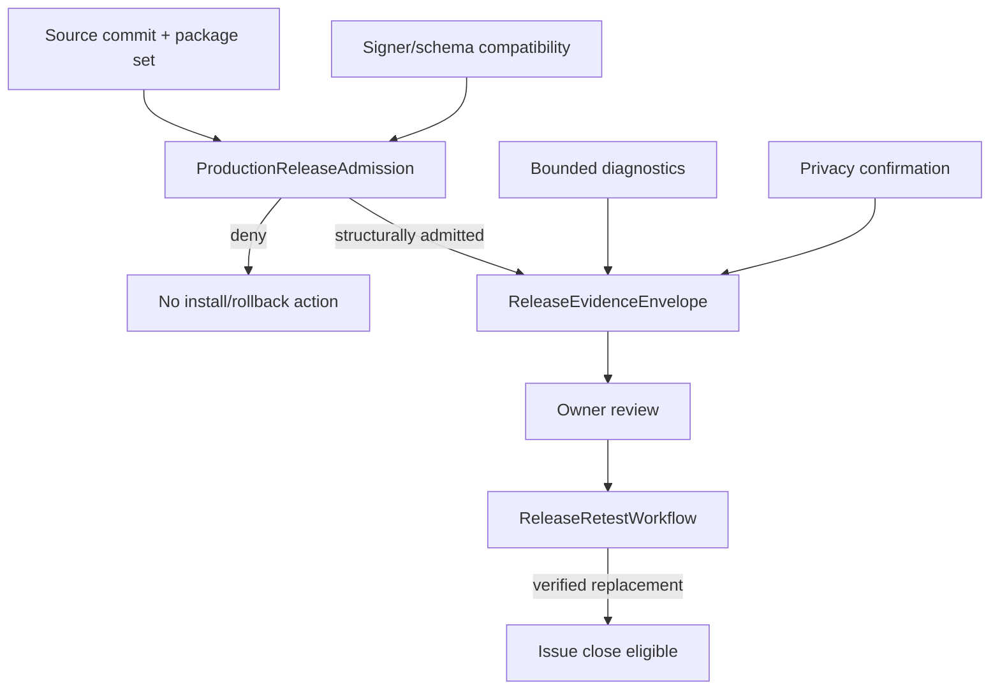

# 安全、隐私、诊断与发布模块详设

版本：1.0
适用范围：Android 13 生产软件
上级文档：[生产软件开发文档](../CENTRAL_BRAIN_SOFTWARE_DEVELOPMENT.md)

`production_document_scope=true`
`module_detailed_design=true`
`production_ready=false`
`target_hardware_validated=false`

## 1. 设计目标与边界

本模块定义跨进程攻击面、隐私数据目录、保留/删除/导出策略、只读诊断、性能预算、稳定性矩阵、发布准入、
证据 envelope 和替换版本复测。它不自动安装、回滚、上传或关闭问题；这些动作需要外部 owner 批准。

安全相关真实执行保持接口预留和失败关闭，不在当前代码中实现越权扫描、任意设备访问或自动外发。

## 2. 需求映射

| Req ID | 本模块责任 |
| --- | --- |
| `S2-SAF-001` 至 `S2-SAF-005` | 安全边界、身份、策略和失败关闭 |
| `S2-MDL-006` | 凭据不进入日志、Event 或 HMI |
| `S2-MEM-002` | 原始内容不进入审计持久层 |
| `S2-OBS-001` | Trace/Metric/Audit/Diagnostics 有界脱敏 |
| `S2-OBS-002` | 里程碑顺序和稳定错误分类 |
| `S2-REL-001` | signer、兼容性、准入、回滚和复测 |

## 3. 源码地图

| 代码路径 | 关键符号 | 设计责任 |
| --- | --- | --- |
| [SecurityBoundaryInventoryContract.java](../../central-brain/android-runtime/runtime-service/src/main/java/com/centralbrain/runtime/security/SecurityBoundaryInventoryContract.java) | namespace/surface inventory | AIDL 攻击面目录 |
| [ParserSecurityCorpusContract.java](../../central-brain/android-runtime/runtime-service/src/main/java/com/centralbrain/runtime/security/ParserSecurityCorpusContract.java) | parser corpus | 有界解析威胁合同 |
| [IdentityReplaySecurityCorpusContract.java](../../central-brain/android-runtime/runtime-service/src/main/java/com/centralbrain/runtime/security/IdentityReplaySecurityCorpusContract.java) | identity/replay corpus | 身份与重放威胁合同 |
| [PrivacyDataInventoryContract.java](../../central-brain/android-runtime/runtime-service/src/main/java/com/centralbrain/runtime/privacy/PrivacyDataInventoryContract.java) | `DataSurface` catalog | 数据面、敏感度和存储模式 |
| [PrivacyLifecyclePolicyAdmission.java](../../central-brain/android-runtime/runtime-service/src/main/java/com/centralbrain/runtime/privacy/PrivacyLifecyclePolicyAdmission.java) | `evaluate`、`evaluateOperation` | policy 与 owner approval |
| [PrivacyRedactionAuditProjection.java](../../central-brain/android-runtime/runtime-service/src/main/java/com/centralbrain/runtime/privacy/PrivacyRedactionAuditProjection.java) | allowed audit keys | 脱敏审计 |
| [CentralBrainDiagnosticService.java](../../central-brain/android-runtime/runtime-service/src/main/java/com/centralbrain/runtime/CentralBrainDiagnosticService.java) | `getPage`、`records` | signature 保护的只读诊断 |
| [FieldDiagnosticsProjection.java](../../central-brain/android-runtime/runtime-service/src/main/java/com/centralbrain/runtime/release/FieldDiagnosticsProjection.java) | `evaluate` | 现场诊断摘要 |
| [PerformanceBudgetContract.java](../../central-brain/android-runtime/runtime-service/src/main/java/com/centralbrain/runtime/performance/PerformanceBudgetContract.java) | budget catalog、`evaluate` | 延迟/资源预算 |
| [StabilityFaultMatrixContract.java](../../central-brain/android-runtime/runtime-service/src/main/java/com/centralbrain/runtime/reliability/StabilityFaultMatrixContract.java) | fault matrix、`evaluate` | 稳定性准入 |
| [ProductionReleaseAdmission.java](../../central-brain/android-runtime/runtime-service/src/main/java/com/centralbrain/runtime/release/ProductionReleaseAdmission.java) | `evaluate` | release set 与 signer/schema 兼容 |
| [ProductionReleaseMetadataProjection.java](../../central-brain/android-runtime/runtime-service/src/main/java/com/centralbrain/runtime/release/ProductionReleaseMetadataProjection.java) | package observation | 安装包元数据投影 |
| [ReleaseEvidenceEnvelope.java](../../central-brain/android-runtime/runtime-service/src/main/java/com/centralbrain/runtime/release/ReleaseEvidenceEnvelope.java) | `Report`、`evaluate` | 安全证据结构 |
| [ReleaseRetestWorkflow.java](../../central-brain/android-runtime/runtime-service/src/main/java/com/centralbrain/runtime/release/ReleaseRetestWorkflow.java) | `advance`、`requestRetest`、`submitRetest` | 替换版本复测状态机 |
| [production release contract](../../central-brain/contracts/central_brain_android_p9_production_release_admission.json) | release machine contract | 发布门禁 |
| [privacy inventory contract](../../central-brain/contracts/central_brain_android_p9_privacy_data_inventory.json) | privacy machine contract | 隐私目录 |

## 4. 核心设计

### 4.1 安全边界

`SecurityBoundaryInventoryContract` 记录所有 AIDL namespace 的 interface/Parcelable 数量和 validation family。
任何新增外部字段都必须进入库存。Parser corpus 覆盖超深、超长、未知字段、重复字段、非法编码和摘要不一致；
Identity corpus 覆盖 owner 混淆、UID/package/signer 不一致和 replay。

这些 corpus 是合同，不等于目标平台安全验收；未完成 owner-approved evidence 时 readiness 保持 false。

### 4.2 隐私目录

`PrivacyDataInventoryContract.DataSurface` 为每个数据面声明：

- sensitivity、storage mode、content form；
- owner scope、consent mode；
- retention、deletion、export、log mode；
- enforcement state 和 source classes。

聚合不变量要求原始用户文本、模型输出、车辆载荷、位置和图像不进入 audit durable store。

### 4.3 Diagnostics

`CentralBrainDiagnosticService` 使用独立 signature permission，只返回 `DiagnosticPage`。Query cursor 和 page
size 有上限；record 仅含 category、state、count、reason code 和 digest。Diagnostics 不接受 Task/Effect
命令。

### 4.4 发布准入

`ProductionReleaseAdmission` 将 Runtime、Client2、RenderService 视为同一 release set，校验 release ID、
source/archive digest、package set、version code、signer、artifact digest 和 Room schema 可读范围。

升级、回滚和 dry-run 都是纯 decision；当前实现不会安装、卸载或修改数据库。

### 4.5 证据与复测

`ReleaseEvidenceEnvelope` 只接受非秘密 device alias、外部 evidence reference、release identity、privacy
confirmation 和 typed diagnostic facts。原始设备标识、日志、用户/模型内容、签名材料不得进入仓库。

`ReleaseRetestWorkflow` 要求 replacement release 严格更新，测试人员提交匹配报告后才进入可关闭状态；
自动关闭始终禁止。

## 5. 接口与数据

允许的诊断/审计字段类别：

```text
state, reason_code, count, latency_bucket, revision,
release_id, package_id, schema_version, evidence_digest
```

禁止字段类别：

```text
raw user/model text, image bytes, vehicle payload, location,
credential, signing key, raw device identity
```

发布证据只证明特定 release tag、source commit、archive digest 和 approved device alias，不能跨版本复用。

## 6. 关键流程



## 7. 失败关闭与并发

- 安全/隐私合同只返回决定，不执行系统变更。
- signer、artifact、schema 或 owner approval 缺失时 release deny。
- Diagnostics 权限与 Runtime/ Governance 权限分离。
- 证据 envelope 发现原始设备身份或 automatic upload 时拒绝。
- replacement release 必须与报告 identity 完全匹配。
- 未验证的性能/稳定性 observation 不能提升 production 状态。
- 日志 formatter 必须对异常文本做稳定分类，不能记录上游原文。

## 8. 代码校对清单

- [ ] 新 AIDL/Parcelable 已进入 security inventory。
- [ ] 新 parser 有长度、深度、token、unknown-field 和编码限制。
- [ ] 新数据面已登记 sensitivity/consent/retention/delete/export/log。
- [ ] audit/diagnostics 只含允许字段和摘要。
- [ ] 凭据、签名材料和原始设备身份不进入输出。
- [ ] release set 包含全部协同 APK/AAR 和 schema 兼容信息。
- [ ] admission 类无安装、卸载、数据库修改或自动上传副作用。
- [ ] retest 报告绑定 replacement release，且不自动关闭问题。
- [ ] production/target 状态只由 owner-approved evidence 提升。

## 9. 增量开发规则

新增模块或数据面时同步更新 security inventory、privacy inventory、diagnostic projection、performance budget、
fault matrix 和 release package set。外部 owner 批准和目标证据必须以摘要和 reference 接入，不能把原始资料
提交到仓库。

## 10. 当前缺口

- OEM 安全、隐私、signer、发布、性能和稳定性 owner approval 尚未齐备。
- installer、rollback executor、production diagnostics wiring 和目标报告准入尚未闭环。
- `production_ready=false`，`target_hardware_validated=false`。
